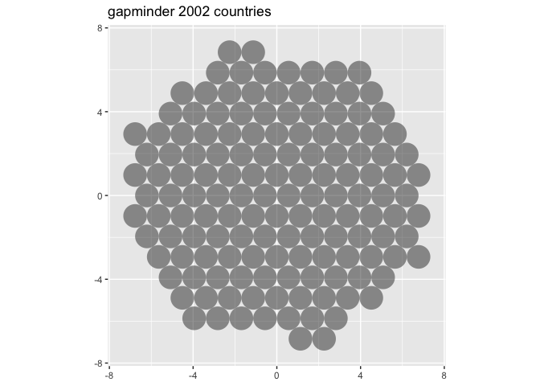
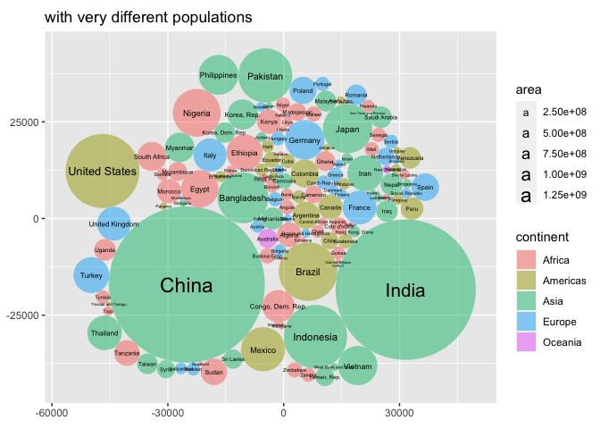
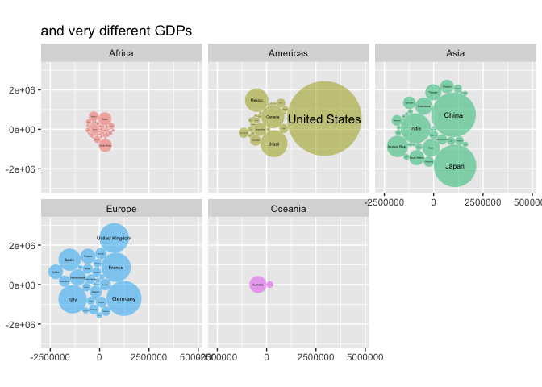
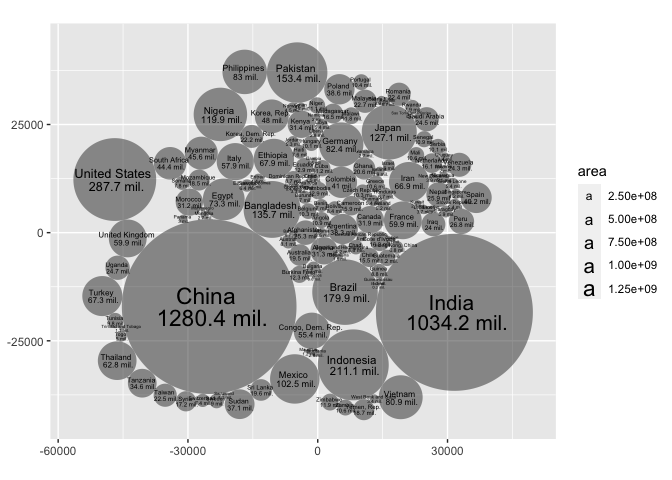

<!-- README.md is generated from README.Rmd. Please edit that file -->

# ggcirclepack

<!-- badges: start -->

<!-- badges: end -->

circle pack is an experimental package that uses packcircles to handle
circle packing computation.

# status quo w/o {ggcirclepack}: loads of work before plotting

``` r
gapminder::gapminder %>%  
  filter(continent == "Americas") %>%  
  filter(year == 2002) %>%  
  select(country, pop) %>% 
  mutate(id = row_number()) ->  
df_w_id

packcircles::circleProgressiveLayout(df_w_id$pop,  
                                         sizetype = 'area') ->  
x0y0radius  

x0y0radius %>%  
  packcircles::circleLayoutVertices(npoints = 50) ->  
circle_outlines  

circle_outlines %>% 
  left_join(df_w_id) %>% 
  ggplot() +  
  aes(x = x, y = y) +  
  geom_polygon(colour = "black", alpha = 0.6) +  
  aes(group = id) +  
  aes(fill = pop) +  
  geom_text(data = cbind(df_w_id, x0y0radius),  
            aes(x, y, size = pop, label = country,  
                group = NULL, fill = NULL)) +  
  theme(legend.position = "none") +  
  coord_equal()
#> Joining with `by = join_by(id)`
```


# Proposed UI

``` r
library(tidyverse)
library(ggcirclepack)

gapminder::gapminder %>%
filter(year == 2002) %>%
  ggplot() +
  aes(id = country, area = pop) +
  geom_polygon_circlepack(alpha = .5) + 
  geom_text_circlepack() 
```


# Package functions

## geom\_circle\_pack

### compute

``` r
# Step 1
#' compute_panel_circle_pack
#'
#' @param data
#' @param scales
#'
#' @return
#' @export
#'
#' @examples
#' TBD
compute_panel_circle_pack <- function(data, scales){

  data %>%
    mutate(id = row_number()) ->
    data1

  if(is.null(data$area)){

    data1 %>%
      mutate(area = 1) ->
      data1

  }

  data1 %>%
    pull(area) %>%
    packcircles::circleProgressiveLayout(
      sizetype = 'area') %>%
    packcircles::circleLayoutVertices(npoints = 300) %>%
    left_join(data1) #%>%

}
```

### test compute

``` r
gapminder::gapminder %>%
filter(continent == "Americas") %>%
  filter(year == 2002) %>%
  # input must have required aesthetic inputs as columns
  rename(area = pop) %>%
  compute_panel_circle_pack() %>%
  head()
#> Joining with `by = join_by(id)`
#>             x         y id   country continent year lifeExp     area gdpPercap
#> 1   0.0000000   0.00000  1 Argentina  Americas 2002   74.34 38331121  8797.641
#> 2  -0.7660766  73.15225  1 Argentina  Americas 2002   74.34 38331121  8797.641
#> 3  -3.0639703 146.27241  1 Argentina  Americas 2002   74.34 38331121  8797.641
#> 4  -6.8926731 219.32842  1 Argentina  Americas 2002   74.34 38331121  8797.641
#> 5 -12.2505058 292.28821  1 Argentina  Americas 2002   74.34 38331121  8797.641
#> 6 -19.1351181 365.11980  1 Argentina  Americas 2002   74.34 38331121  8797.641
```

### ggproto and geom

``` r
StatCirclepack <- ggplot2::ggproto(`_class` = "StatCirclepack",
                                  `_inherit` = ggplot2::Stat,
                                  required_aes = c("id"),
                                  compute_panel = compute_panel_circle_pack,
                                  # setup_data = my_setup_data,
                                  default_aes = ggplot2::aes(group = after_stat(id))
                                  )


#' Title
#'
#' @param mapping
#' @param data
#' @param position
#' @param na.rm
#' @param show.legend
#' @param inherit.aes
#' @param ...
#'
#' @return
#' @export
#'
#' @examples
#' # TBD
geom_polygon_circlepack <- function(mapping = NULL, data = NULL,
                           position = "identity", na.rm = FALSE,
                           show.legend = NA,
                           inherit.aes = TRUE, ...) {
  ggplot2::layer(
    stat = StatCirclepack, # proto object from Step 2
    geom = ggplot2::GeomPolygon, # inherit other behavior
    data = data,
    mapping = mapping,
    position = position,
    show.legend = show.legend,
    inherit.aes = inherit.aes,
    params = list(na.rm = na.rm, ...)
  )
}
```

### test geom

## geom\_text\_circlepack

### compute panel

``` r
#' compute_panel_circle_pack
#'
#' @param data
#' @param scales
#'
#' @return
#' @export
#'
#' @examples
#' # TBD
compute_panel_circle_pack_center <- function(data, scales){

  data ->
    data1

  if(is.null(data$area)){

    data1 %>%
      mutate(area = 1) ->
      data1

  }

  data1 %>%
    pull(area) %>%
    packcircles::circleProgressiveLayout(
      sizetype = 'area') %>%
    cbind(data1) %>%
    mutate(label = id)

}
```

### test compute

``` r
gapminder::gapminder %>%
filter(continent == "Americas") %>%
  filter(year == 2002) %>%
  # input must have required aesthetic inputs as columns
  select(area = pop, id = country) %>%
  compute_panel_circle_pack_center() %>%
  head()
#>           x         y   radius      area        id     label
#> 1 -3493.018     0.000 3493.018  38331121 Argentina Argentina
#> 2  1639.564     0.000 1639.564   8445134   Bolivia   Bolivia
#> 3  2732.774 -9142.026 7567.594 179914212    Brazil    Brazil
#> 4  1150.752  4801.407 3186.661  31902268    Canada    Canada
#> 5  5273.817  1302.381 2221.005  15497046     Chile     Chile
#> 6 10562.330 -1160.651 3612.938  41008227  Colombia  Colombia
```

### ggproto and geom

``` r
StatCirclepackcenter <- ggplot2::ggproto(`_class` = "StatCirclepackcenter",
                                  `_inherit` = ggplot2::Stat,
                                  required_aes = c("id"),
                                  compute_panel = compute_panel_circle_pack_center,
                                  # setup_data = my_setup_data,
                                  default_aes = ggplot2::aes(group = after_stat(id),
                                                             size = after_stat(area))
                                  )


#' Title
#'
#' @param mapping
#' @param data
#' @param position
#' @param na.rm
#' @param show.legend
#' @param inherit.aes
#' @param ...
#'
#' @return
#' @export
#'
#' @examples
#' # TBD
geom_text_circlepack <- function(mapping = NULL, data = NULL,
                           position = "identity", na.rm = FALSE,
                           show.legend = NA,
                           inherit.aes = TRUE, ...) {
  ggplot2::layer(
    stat = StatCirclepackcenter, # proto object from Step 2
    geom = ggplot2::GeomText, # inherit other behavior
    data = data,
    mapping = mapping,
    position = position,
    show.legend = show.legend,
    inherit.aes = inherit.aes,
    params = list(na.rm = na.rm, ...)
  )
}
```

### test geom

``` r

gapminder::gapminder %>%
filter(year == 2002) %>%
  ggplot() +
  aes(id = country) +
  geom_polygon_circlepack(alpha = .5) + 
  coord_equal() + 
  labs(title = "gapminder 2002 countries")
#> Joining with `by = join_by(id)`
```



``` r

last_plot() +
  aes(fill = continent) + 
  labs(title = "from 5 continents")
#> Joining with `by = join_by(id)`
```


``` r

last_plot() +
  aes(area = pop) + 
  geom_text_circlepack() + 
  labs(title = "with very different populations")
#> Joining with `by = join_by(id)`
```



``` r

last_plot() +
  facet_wrap(facets = vars(continent)) + 
  labs(title = "faceting")
#> Joining with `by = join_by(id)`
#> Joining with `by = join_by(id)`
#> Joining with `by = join_by(id)`
#> Joining with `by = join_by(id)`
#> Joining with `by = join_by(id)`
```


``` r

last_plot() + 
  scale_size_continuous(range = c(0, 4)) + 
  theme(legend.position = "none") + 
  labs(title = "remove legends")
#> Joining with `by = join_by(id)`
#> Joining with `by = join_by(id)`
#> Joining with `by = join_by(id)`
#> Joining with `by = join_by(id)`
#> Joining with `by = join_by(id)`
```


``` r

last_plot() + 
  aes(area = gdpPercap*pop) + 
  labs(title = "and very different GDPs")
#> Joining with `by = join_by(id)`
#> Joining with `by = join_by(id)`
#> Joining with `by = join_by(id)`
#> Joining with `by = join_by(id)`
#> Joining with `by = join_by(id)`
```



``` r

last_plot() + 
  aes(area = gdpPercap) + 
  labs(title = "and per capita GDPs")
#> Joining with `by = join_by(id)`
#> Joining with `by = join_by(id)`
#> Joining with `by = join_by(id)`
#> Joining with `by = join_by(id)`
#> Joining with `by = join_by(id)`
```


``` r


gapminder::gapminder %>%
filter(year == 2002) %>%
  ggplot() +
  aes(id = country) +
  geom_polygon_circlepack(alpha = .5) + 
  coord_equal() +
  aes(area = pop) + 
  geom_text_circlepack(aes(label = after_stat(
    paste(id, "\n",
    round(area/1000000, 1), "mil."))), lineheight = .8)
#> Joining with `by = join_by(id)`
```



``` r
readme2pkg::chunk_to_r(chunk_name = "compute_panel_circle_pack")
readme2pkg::chunk_to_r(chunk_name = "geom_circle_pack")
readme2pkg::chunk_to_r(chunk_name = "compute_panel_circle_pack_center")
readme2pkg::chunk_to_r(chunk_name = "geom_text_circlepack")
```

## Issues

Wish list for ggcirclepack: More computation under the hood for a count
data case.

``` r
tidytitanic::tidy_titanic %>% 
  head()
#>   id class  sex   age survived
#> 1  1   3rd Male Child       No
#> 2  2   3rd Male Child       No
#> 3  3   3rd Male Child       No
#> 4  4   3rd Male Child       No
#> 5  5   3rd Male Child       No
#> 6  6   3rd Male Child       No
```

    tidytitanic::tidy_titanic() + 
      ggplot() + 
      aes(x = "all") + 
      geom_polygon_circlepack(alpha = .5) + 
      geom_text_circlepack(aes(label = afterstat(count))) + # automatically labels with count
      aes(linetype = sex) + 
      aes(color = age) + 
      aes(alpha = survived) + 
      facet_wrap(~class)

Quiet the joins.
