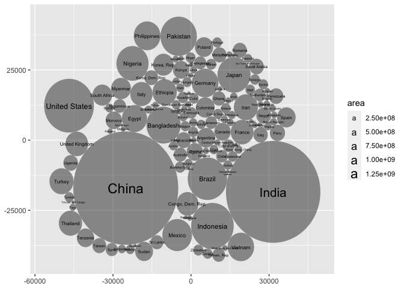
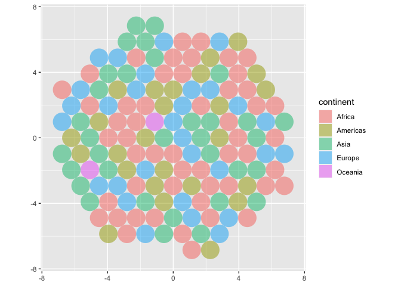
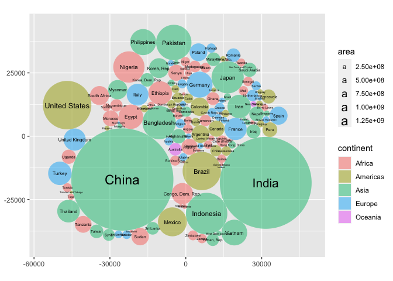
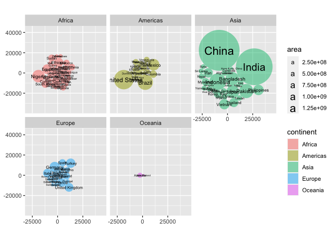

<!-- README.md is generated from README.Rmd. Please edit that file -->

# ggcirclepack

<!-- badges: start -->

<!-- badges: end -->

The goal of ggcirclepack is to …

## Installation

You can install the development version of ggcirclepack from
[GitHub](https://github.com/) with:

``` r
# install.packages("devtools")
devtools::install_github("EvaMaeRey/ggcirclepack")
```

## Example

This is a basic example which shows you how to solve a common problem:

``` r
library(ggcirclepack)
library(ggplot2)
library(magrittr)
library(dplyr)
#> 
#> Attaching package: 'dplyr'
#> The following objects are masked from 'package:stats':
#> 
#>     filter, lag
#> The following objects are masked from 'package:base':
#> 
#>     intersect, setdiff, setequal, union

gapminder::gapminder %>%
filter(year == 2002) %>%
  ggplot() +
  aes(id = country) +
  geom_polygon_circlepack(alpha = .5, size = .002)
#> Warning: Using `size` aesthetic for lines was deprecated in ggplot2 3.4.0.
#> ℹ Please use `linewidth` instead.
#> This warning is displayed once every 8 hours.
#> Call `lifecycle::last_lifecycle_warnings()` to see where this warning was
#> generated.
#> Joining with `by = join_by(id)`
```



``` r

last_plot() +
  aes(fill = continent)
#> Joining with `by = join_by(id)`
```



``` r

last_plot() +
  aes(area = pop)
#> Joining with `by = join_by(id)`
```



``` r

last_plot() +
  aes(color = continent) +
  facet_wrap(facets = vars(continent))
#> Joining with `by = join_by(id)`
#> Joining with `by = join_by(id)`
#> Joining with `by = join_by(id)`
#> Joining with `by = join_by(id)`
#> Joining with `by = join_by(id)`
```


