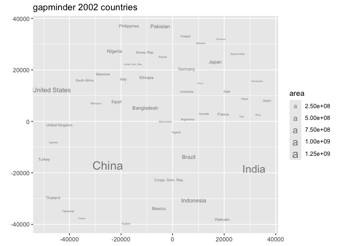
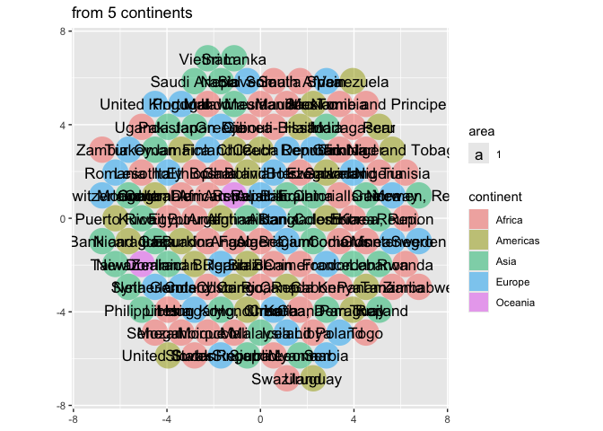
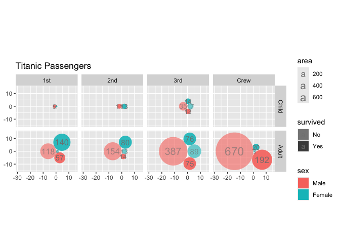

  - [ggcirclepack](#ggcirclepack)
      - [Note to the reader](#note-to-the-reader)
  - [status quo *without* {ggcirclepack}: precomputation required to
    create two more data
    frames](#status-quo-without-ggcirclepack-precomputation-required-to-create-two-more-data-frames)
  - [Proposed UI](#proposed-ui)
  - [Package functions](#package-functions)
      - [geom\_circlepack\_text (center)](#geom_circlepack_text-center)
          - [Step 1. compute panel](#step-1-compute-panel)
          - [Step 1.1 test compute](#step-11-test-compute)
          - [Step 2 and 3 ggproto and
            geom](#step-2-and-3-ggproto-and-geom)
          - [Step 4. test geom](#step-4-test-geom)
      - [geom\_circlepack](#geom_circlepack)
          - [Step 1. compute\_panel](#step-1-compute_panel)
          - [Step 1.1. test compute](#step-11-test-compute-1)
          - [Step 2 & 3 ggproto and geom](#step-2--3-ggproto-and-geom)
          - [Step 4. test geom](#step-4-test-geom-1)
  - [Package the functions](#package-the-functions)
  - [Issues](#issues)
      - [More computation under the hood for a count data
        case.](#more-computation-under-the-hood-for-a-count-data-case)

<!-- README.md is generated from README.Rmd. Please edit that file -->

# ggcirclepack

<!-- badges: start -->

<!-- badges: end -->

circle pack is an experimental package that uses the {packcircles}
package to handle circle packing computation.

### Note to the reader

Your feedback is on this work is greatly appreciated.

Beyond the descriptions of our work, we interject comments on our
hesitations 🤔 and areas that need some work 🚧, for your consideration
marked with emoji.

Your help and feedback would be greatly appreciated on any of the
questions…

  - Are functions named intuitively? *‘According to IBM studies,
    intuitive variable naming contributes more to code readability than
    comments, or for that matter, any other factor’ McConnell, S. Code
    complete*
  - Do functions work as you expect?
  - Is there rewriting that could make the code more concise?
  - What tests should be performed?

# status quo *without* {ggcirclepack}: precomputation required to create two more data frames

``` r
library(tidyverse)
#> ── Attaching core tidyverse packages ──────────────────────── tidyverse 2.0.0 ──
#> ✔ dplyr     1.1.4     ✔ readr     2.1.5
#> ✔ forcats   1.0.0     ✔ stringr   1.5.1
#> ✔ ggplot2   3.5.1     ✔ tibble    3.2.1
#> ✔ lubridate 1.9.3     ✔ tidyr     1.3.1
#> ✔ purrr     1.0.2     
#> ── Conflicts ────────────────────────────────────────── tidyverse_conflicts() ──
#> ✖ dplyr::filter() masks stats::filter()
#> ✖ dplyr::lag()    masks stats::lag()
#> ℹ Use the conflicted package (<http://conflicted.r-lib.org/>) to force all conflicts to become errors
```

``` r
gapminder::gapminder %>%  
  filter(continent == "Americas") %>%  
  filter(year == 2002) %>%  
  select(country, pop) %>% 
  mutate(id = row_number()) ->  
df_w_id

packcircles::circleProgressiveLayout(df_w_id$pop,  
                                         sizetype = 'area') ->  
x0y0radius  

x0y0radius %>%  
  packcircles::circleLayoutVertices(npoints = 50) ->  
circle_outlines  

circle_outlines %>% 
  left_join(df_w_id) %>% 
  ggplot() +  
  aes(x = x, y = y) +  
  geom_polygon(colour = "black", alpha = 0.6) +  
  aes(group = id) +  
  aes(fill = pop) +  
  geom_text(data = cbind(df_w_id, x0y0radius),  
            aes(x, y, size = pop, label = country,  
                group = NULL, fill = NULL)) +  
  theme(legend.position = "none") +  
  coord_equal()
#> Joining with `by = join_by(id)`
```


# Proposed UI

``` r
library(tidyverse)
library(ggcirclepack)

gapminder::gapminder %>%
filter(year == 2002) %>%
  ggplot() +
  aes(id = country, area = pop) +
  geom_circlepack() +               # draws packed circles 
  geom_circlepack_text() +          # labels at the center
  coord_fixed(ratio = 1)
```

# Package functions

## geom\_circlepack\_text (center)

### Step 1. compute panel

``` r
#' compute_panel_circlepack_center
#'
#' @return
#' @export
#'
#' @examples
compute_panel_circlepack_center <- function(data, scales){

  # get aes names as they appear in the data
  data_mapped_aes_names <- names(data)[names(data) %in% 
                                         c("id", "fill", "alpha", 
                                             "colour", "group", "linewidth", 
                                             "linetype", "render")]
  
  if(is.null(data$area)){data$area <- 1}
  data$value <- data$area
  
  data %>% 
    group_by(across(data_mapped_aes_names)) ->
  data
  
  data %>% 
    count(wt = area) %>% 
    # ungroup() %>%
    arrange(id) %>% # this doesn't feel very principled; motivation is when you go from no fill to color, preserves circle position...
    rename(area = n) ->
  data

  data %>%
    pull(area) %>%
    packcircles::circleProgressiveLayout(
      sizetype = 'area') %>%
    cbind(data) ->
  data
  
  if(!is.null(data$render)){
    
    data %>% 
      filter(.data$render) ->
    data
    
  }
  
  data
}
```

### Step 1.1 test compute

``` r
gapminder::gapminder %>%
filter(continent == "Americas") %>%
  filter(year == 2002) %>%
  # input must have required aesthetic inputs as columns
  select(area = pop, id = country) %>%
  compute_panel_circlepack_center() %>%
  head()
#> Warning: There was 1 warning in `group_by()`.
#> ℹ In argument: `across(data_mapped_aes_names)`.
#> Caused by warning:
#> ! Using an external vector in selections was deprecated in tidyselect 1.1.0.
#> ℹ Please use `all_of()` or `any_of()` instead.
#>   # Was:
#>   data %>% select(data_mapped_aes_names)
#> 
#>   # Now:
#>   data %>% select(all_of(data_mapped_aes_names))
#> 
#> See <https://tidyselect.r-lib.org/reference/faq-external-vector.html>.
#>           x         y   radius        id      area
#> 1 -3493.018     0.000 3493.018 Argentina  38331121
#> 2  1639.564     0.000 1639.564   Bolivia   8445134
#> 3  2732.774 -9142.026 7567.594    Brazil 179914212
#> 4  1150.752  4801.407 3186.661    Canada  31902268
#> 5  5273.817  1302.381 2221.005     Chile  15497046
#> 6 10562.330 -1160.651 3612.938  Colombia  41008227
```

``` r

gapminder::gapminder %>% 
  filter(year == 2002) %>% 
  select(id = continent) %>% 
  compute_panel_circlepack_center()
#> Warning: Unknown or uninitialised column: `area`.
#>            x         y    radius       id area
#> 1 -4.0684289  0.000000 4.0684289   Africa   52
#> 2  2.8209479  0.000000 2.8209479 Americas   25
#> 3  0.5868621 -5.635277 3.2410224     Asia   33
#> 4  0.5595510  5.461472 3.0901936   Europe   30
#> 5  3.8910939  3.456984 0.7978846  Oceania    2
```

``` r

gapminder::gapminder %>% 
  filter(year == 2002) %>% 
  mutate( render = country == "Argentina") %>% 
  select(id = continent, render) %>% 
  compute_panel_circlepack_center()
#> Warning: Unknown or uninitialised column: `area`.
#>           x         y    radius       id render area
#> 1 0.1077182 -2.005231 0.5641896 Americas   TRUE    1
```

### Step 2 and 3 ggproto and geom

``` r
StatCirclepackcenter <- ggplot2::ggproto(`_class` = "StatCirclepackcenter",
                                  `_inherit` = ggplot2::Stat,
                                  required_aes = c("id"),
                                  compute_panel = compute_panel_circlepack_center,
                                  default_aes = ggplot2::aes(group = after_stat(id),
                                                             size = after_stat(area),
                                                             label = after_stat(id))
                                  )


#' Title
#'
#' @param mapping
#' @param data
#' @param position
#' @param na.rm
#' @param show.legend
#' @param inherit.aes
#' @param ...
#'
#' @return
#' @export
#'
#' @examples
stat_circlepack_center <- function(mapping = NULL, data = NULL,
                                 geom = "text",
                           position = "identity", na.rm = FALSE,
                           show.legend = NA,
                           inherit.aes = TRUE, ...) {
  ggplot2::layer(
    geom = geom, # inherit other behavior
    stat = StatCirclepackcenter, # proto object from Step 2
    data = data,
    mapping = mapping,
    position = position,
    show.legend = show.legend,
    inherit.aes = inherit.aes,
    params = list(na.rm = na.rm, ...)
  )
}


#' Title
#'
#' @param mapping
#' @param data
#' @param position
#' @param na.rm
#' @param show.legend
#' @param inherit.aes
#' @param ...
#'
#' @return
#' @export
#'
#' @examples
geom_circlepack_text <- stat_circlepack_center
```

### Step 4. test geom

``` r
gapminder::gapminder %>%
filter(year == 2002) %>%
  ggplot() +
  aes(id = country, area = pop) +
  geom_circlepack_text(alpha = .5) + 
  coord_equal() + 
  labs(title = "gapminder 2002 countries")
```


``` r

last_plot() + 
  aes(render = pop > 20000000)
```



## geom\_circlepack

### Step 1. compute\_panel

``` r
# Step 1
#' compute_panel_circlepack
#'
#' @param data
#' @param scales
#'
#' @return
#' @export
#'
#' @examples
compute_panel_circlepack <- function(data, scales, npoints = 50){

  data_mapped_aes_names <- names(data)[names(data) %in% c("id", "fill", "alpha", 
                                             "colour", "group", "linewidth", 
                                             "linetype")]
  
  if(is.null(data$area)){data$area <- 1}
  
  data %>% 
    group_by(across(data_mapped_aes_names)) ->
  data 
  
  data %>% 
    count(wt = area) %>% 
    # ungroup() %>%
    arrange(id) %>%  # this doesn't feel very principled
    rename(area = n) ->
  data

  data$id = 1:nrow(data)

  data %>%
    pull(area) %>%
    packcircles::circleProgressiveLayout(
      sizetype = 'area') %>%
    packcircles::circleLayoutVertices(npoints = npoints) %>%
    left_join(data, by = join_by(id)) 

}
```

### Step 1.1. test compute

``` r
gapminder::gapminder %>%
filter(continent == "Americas") %>%
  filter(year == 2002) %>%
  # input must have required aesthetic inputs as columns
  rename(id = country, area = pop) %>%
  compute_panel_circlepack() %>%
  head()
#>            x         y id     area
#> 1    0.00000    0.0000  1 38331121
#> 2  -27.54349  437.7912  1 38331121
#> 3 -109.73958  868.6783  1 38331121
#> 4 -245.29200 1285.8657  1 38331121
#> 5 -432.06299 1682.7743  1 38331121
#> 6 -667.10708 2053.1445  1 38331121
```

### Step 2 & 3 ggproto and geom

``` r
StatCirclepack <- ggplot2::ggproto(`_class` = "StatCirclepack",
                                  `_inherit` = ggplot2::Stat,
                                  required_aes = c("id"),
                                  compute_panel = compute_panel_circlepack,
                                  default_aes = ggplot2::aes(group = after_stat(id))
                                  )

#' Title
#'
#' @param mapping
#' @param data
#' @param position
#' @param na.rm
#' @param show.legend
#' @param inherit.aes
#' @param ...
#'
#' @return
#' @export
#'
#' @examples
geom_circlepack <- function(mapping = NULL, data = NULL,
                           position = "identity", na.rm = FALSE,
                           show.legend = NA,
                           inherit.aes = TRUE, ...) {
  ggplot2::layer(
    stat = StatCirclepack, # proto object from Step 2
    geom = ggplot2::GeomPolygon, # inherit other behavior
    data = data,
    mapping = mapping,
    position = position,
    show.legend = show.legend,
    inherit.aes = inherit.aes,
    params = list(na.rm = na.rm, ...)
  )
}
```

### Step 4. test geom

``` r


gapminder::gapminder %>%
filter(year == 2002) %>%
  ggplot() +
  aes(id = country) +
  geom_circlepack(alpha = .5) + 
  geom_circlepack_text() +
  coord_equal() + 
  labs(title = "gapminder 2002 countries")
```


``` r

last_plot() +
  aes(fill = continent) + 
  labs(title = "from 5 continents")
```



``` r

last_plot() +
  aes(area = pop) + 
  geom_circlepack_text() + 
  labs(title = "with very different populations")
```


``` r

last_plot() +
  facet_wrap(facets = vars(continent)) + 
  labs(title = "faceting")
```


``` r

last_plot() + 
  scale_size_continuous(range = c(0, 4)) + 
  theme(legend.position = "none") + 
  labs(title = "remove legends")
```


``` r

last_plot() + 
  aes(area = gdpPercap*pop) + 
  labs(title = "and very different GDPs")
```


``` r

last_plot() + 
  aes(area = gdpPercap) + 
  labs(title = "and per capita GDPs")
```


``` r


gapminder::gapminder %>%
filter(year == 2002) %>%
  ggplot() +
  aes(id = country) +
  geom_circlepack(alpha = .5) + 
  coord_equal() +
  aes(area = pop) + 
  geom_circlepack_text(aes(label = after_stat(
    paste(id, "\n",
    round(area/1000000, 1), "mil."))), lineheight = .8)
```


``` r

gapminder::gapminder %>%
filter(year == 2002) %>%
  ggplot() +
  aes(id = continent) + 
  geom_circlepack() +
  geom_circlepack_text(alpha = .5) + 
  coord_equal() +
  aes(fill = continent)
```


``` r

last_plot() + 
  aes(id = country)
```


``` r

last_plot() + 
  aes(area = pop)
```


``` r
 

last_plot() + 
  facet_wrap(~continent)
```


``` r


gapminder::gapminder %>%
filter(year == 2002) %>%
  ggplot() +
  aes(id = country) + 
  geom_circlepack() +
  geom_circlepack_text(alpha = .5) +
  aes(area = pop) + 
  coord_equal() + 
  aes(fill = continent) + 
  aes(render = pop > 20000000)
```


``` r

# GeomTextRepel
gapminder::gapminder %>%
filter(year == 2002) %>%
  ggplot() +
  aes(id = country) + 
  geom_circlepack() +
  layer(geom = ggrepel::GeomTextRepel, 
        stat = StatCirclepackcenter, 
        position = "identity") +
  aes(area = pop) + 
  coord_equal() + 
  aes(fill = continent) + 
  aes(render = pop > 20000000)
```


# Package the functions

``` r
knitrExtra:::chunk_to_r(chunk_name = "compute_panel_circlepack")
#> It seems you are currently knitting a Rmd/Qmd file. The parsing of the file will be done in a new R session.
```

``` r
knitrExtra:::chunk_to_r(chunk_name = "geom_circlepack")
#> It seems you are currently knitting a Rmd/Qmd file. The parsing of the file will be done in a new R session.
```

``` r
knitrExtra:::chunk_to_r(chunk_name = "compute_panel_circlepack_center")
#> It seems you are currently knitting a Rmd/Qmd file. The parsing of the file will be done in a new R session.
```

``` r
knitrExtra:::chunk_to_r(chunk_name = "geom_circlepack_text")
#> It seems you are currently knitting a Rmd/Qmd file. The parsing of the file will be done in a new R session.
```

``` r
devtools::document()
devtools::check()
devtools::install(pkg = ".", upgrade = "never") 
```

# Issues

Wish list for ggcirclepack:

## More computation under the hood for a count data case.

``` r
tidytitanic::tidy_titanic %>% 
  head()
```

``` r
tidytitanic::tidy_titanic %>% 
  ggplot() + 
  aes(id = "all") + 
  geom_circlepack() +
  geom_circlepack_text(aes(label = after_stat(area)), color = "gray50") +
  coord_equal() + 
  labs(title = "Titanic Passengers")
#> Warning in geom_circlepack(): All aesthetics have length 1, but the data has 2201 rows.
#> ℹ Please consider using `annotate()` or provide this layer with data containing
#>   a single row.
#> Warning in geom_circlepack_text(aes(label = after_stat(area)), color = "gray50"): All aesthetics have length 1, but the data has 2201 rows.
#> ℹ Please consider using `annotate()` or provide this layer with data containing
#>   a single row.
```


``` r

layer_data(i = 2)
#> Warning in geom_circlepack(): All aesthetics have length 1, but the data has 2201 rows.
#> ℹ Please consider using `annotate()` or provide this layer with data containing
#>   a single row.
#> All aesthetics have length 1, but the data has 2201 rows.
#> ℹ Please consider using `annotate()` or provide this layer with data containing
#>   a single row.
#>       size label group PANEL  id         x y   radius area colour angle hjust
#> 1 4.535534  2201   all     1 all -26.46885 0 26.46885 2201 gray50     0   0.5
#>   vjust alpha family fontface lineheight
#> 1   0.5    NA               1        1.2
```

``` r


last_plot() +
  aes(fill = sex) +
  scale_size(range = c(3, 6))
```


``` r

last_plot() + 
  aes(alpha = survived) +
  scale_alpha_discrete(range = c(.6,.9))
#> Warning: Using alpha for a discrete variable is not advised.
```


``` r

last_plot() + 
  facet_wrap(~class)
```


``` r

last_plot() + 
  facet_grid(age ~ class)
```


