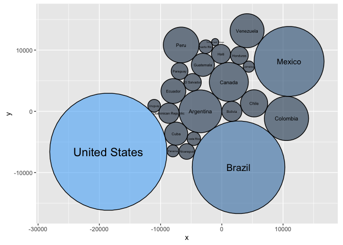
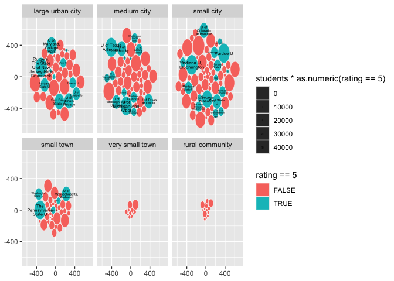
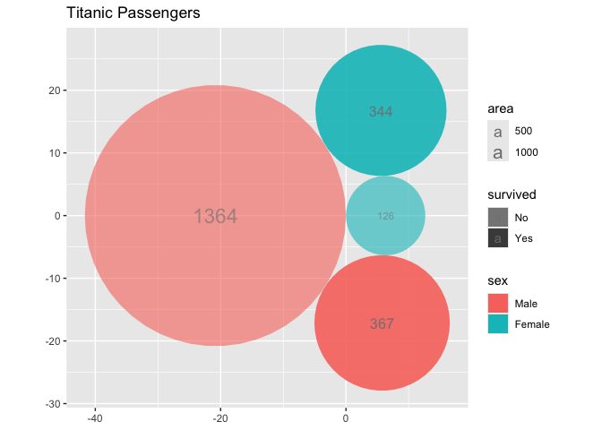
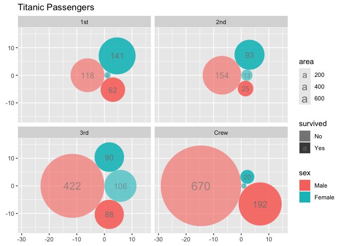

  - [ggcirclepack](#ggcirclepack)
      - [Note to the reader](#note-to-the-reader)
  - [status quo w/o {ggcirclepack}: precomputation required to two more
    data
    frames](#status-quo-wo-ggcirclepack-precomputation-required-to-two-more-data-frames)
  - [Proposed UI](#proposed-ui)
  - [Package functions](#package-functions)
      - [geom\_circlepack\_text (center)](#geom_circlepack_text-center)
          - [Step 1. compute panel](#step-1-compute-panel)
          - [Step 1.1 test compute](#step-11-test-compute)
          - [Step 2 and 3 ggproto and
            geom](#step-2-and-3-ggproto-and-geom)
          - [Step 4. test geom](#step-4-test-geom)
      - [geom\_circlepack](#geom_circlepack)
          - [Step 1. compute\_panel](#step-1-compute_panel)
          - [Step 1.1. test compute](#step-11-test-compute-1)
          - [Step 2 & 3 ggproto and geom](#step-2--3-ggproto-and-geom)
          - [Step 4. test geom](#step-4-test-geom-1)
  - [Package the functions](#package-the-functions)
  - [Issues](#issues)
      - [More computation under the hood for a count data
        case.](#more-computation-under-the-hood-for-a-count-data-case)
      - [Quiet the joins.](#quiet-the-joins)
      - [create a ggcirclepack()/defaults\_circlepack() function for
        preferred
        defaults.](#create-a-ggcirclepackdefaults_circlepack-function-for-preferred-defaults)

<!-- README.md is generated from README.Rmd. Please edit that file -->

# ggcirclepack

<!-- badges: start -->

<!-- badges: end -->

circle pack is an experimental package that uses the {packcircles}
package to handle circle packing computation.

### Note to the reader

Your feedback is on this work is greatly appreciated.

Beyond the descriptions of our work, we interject comments on our
hesitations 🤔 and areas that need some work 🚧, for your consideration
marked with emoji.

Your help and feedback would be greatly appreciated on any of the
questions…

  - Are functions named intuitively? *‘According to IBM studies,
    intuitive variable naming contributes more to code readability than
    comments, or for that matter, any other factor’ McConnell, S. Code
    complete*
  - Do functions work as you expect?
  - Is there rewriting that could make the code more concise?
  - What tests should be performed?

# status quo w/o {ggcirclepack}: precomputation required to two more data frames

``` r
library(tidyverse)
#> ── Attaching core tidyverse packages ──────────────────────── tidyverse 2.0.0 ──
#> ✔ dplyr     1.1.4     ✔ readr     2.1.5
#> ✔ forcats   1.0.0     ✔ stringr   1.5.1
#> ✔ ggplot2   3.5.1     ✔ tibble    3.2.1
#> ✔ lubridate 1.9.3     ✔ tidyr     1.3.1
#> ✔ purrr     1.0.2     
#> ── Conflicts ────────────────────────────────────────── tidyverse_conflicts() ──
#> ✖ dplyr::filter() masks stats::filter()
#> ✖ dplyr::lag()    masks stats::lag()
#> ℹ Use the conflicted package (<http://conflicted.r-lib.org/>) to force all conflicts to become errors
gapminder::gapminder %>%  
  filter(continent == "Americas") %>%  
  filter(year == 2002) %>%  
  select(country, pop) %>% 
  mutate(id = row_number()) ->  
df_w_id

packcircles::circleProgressiveLayout(df_w_id$pop,  
                                         sizetype = 'area') ->  
x0y0radius  

x0y0radius %>%  
  packcircles::circleLayoutVertices(npoints = 50) ->  
circle_outlines  

circle_outlines %>% 
  left_join(df_w_id) %>% 
  ggplot() +  
  aes(x = x, y = y) +  
  geom_polygon(colour = "black", alpha = 0.6) +  
  aes(group = id) +  
  aes(fill = pop) +  
  geom_text(data = cbind(df_w_id, x0y0radius),  
            aes(x, y, size = pop, label = country,  
                group = NULL, fill = NULL)) +  
  theme(legend.position = "none") +  
  coord_equal()
#> Joining with `by = join_by(id)`
```



# Proposed UI

``` r
library(tidyverse)
library(ggcirclepack)

gapminder::gapminder %>%
filter(year == 2002) %>%
  ggplot() +
  aes(id = country, area = pop) +
  geom_circlepack() +               # draws packed circles 
  geom_circlepack_text() +          # labels at the center
  coord_fixed(ratio = 1)
```

# Package functions

## geom\_circlepack\_text (center)

### Step 1. compute panel

``` r
#' compute_panel_circlepack_center
#'
#' @return
#' @export
#'
#' @examples
#' # TBD
compute_panel_circlepack_center <- function(data, scales){

  # get aes names as they appear in the data
  data_mapped_aes_names <- names(data)[names(data) %in% c("id", "fill", "alpha", 
                                             "colour", "group", "linewidth", 
                                             "linetype")]
  
  if(is.null(data$area)){data$area <- 1}
  
  data %>% 
    group_by(across(data_mapped_aes_names)) ->
  data
  
  data %>% 
    count(wt = area) %>% 
    ungroup() %>% 
    # arrange(id) %>% # this doesn't feel very principled
    rename(area = n) ->
  data

  data %>%
    pull(area) %>%
    packcircles::circleProgressiveLayout(
      sizetype = 'area') %>%
    cbind(data) 

}
```

### Step 1.1 test compute

``` r
gapminder::gapminder %>%
filter(continent == "Americas") %>%
  filter(year == 2002) %>%
  # input must have required aesthetic inputs as columns
  select(area = pop, id = country) %>%
  compute_panel_circlepack_center() %>%
  head()
#> Warning: There was 1 warning in `group_by()`.
#> ℹ In argument: `across(data_mapped_aes_names)`.
#> Caused by warning:
#> ! Using an external vector in selections was deprecated in tidyselect 1.1.0.
#> ℹ Please use `all_of()` or `any_of()` instead.
#>   # Was:
#>   data %>% select(data_mapped_aes_names)
#> 
#>   # Now:
#>   data %>% select(all_of(data_mapped_aes_names))
#> 
#> See <https://tidyselect.r-lib.org/reference/faq-external-vector.html>.
#>           x         y   radius        id      area
#> 1 -3493.018     0.000 3493.018 Argentina  38331121
#> 2  1639.564     0.000 1639.564   Bolivia   8445134
#> 3  2732.774 -9142.026 7567.594    Brazil 179914212
#> 4  1150.752  4801.407 3186.661    Canada  31902268
#> 5  5273.817  1302.381 2221.005     Chile  15497046
#> 6 10562.330 -1160.651 3612.938  Colombia  41008227

gapminder::gapminder %>% 
  filter(year == 2002) %>% 
  select(id = continent) %>% 
  compute_panel_circlepack_center()
#> Warning: Unknown or uninitialised column: `area`.
#>            x         y    radius       id area
#> 1 -4.0684289  0.000000 4.0684289   Africa   52
#> 2  2.8209479  0.000000 2.8209479 Americas   25
#> 3  0.5868621 -5.635277 3.2410224     Asia   33
#> 4  0.5595510  5.461472 3.0901936   Europe   30
#> 5  3.8910939  3.456984 0.7978846  Oceania    2
```

### Step 2 and 3 ggproto and geom

``` r
StatCirclepackcenter <- ggplot2::ggproto(`_class` = "StatCirclepackcenter",
                                  `_inherit` = ggplot2::Stat,
                                  required_aes = c("id"),
                                  compute_panel = compute_panel_circlepack_center,
                                  default_aes = ggplot2::aes(group = after_stat(id),
                                                             size = after_stat(area),
                                                             label = after_stat(id))
                                  )


#' Title
#'
#' @param mapping
#' @param data
#' @param position
#' @param na.rm
#' @param show.legend
#' @param inherit.aes
#' @param ...
#'
#' @return
#' @export
#'
#' @examples
#' # TBD
geom_circlepack_text <- function(mapping = NULL, data = NULL,
                           position = "identity", na.rm = FALSE,
                           show.legend = NA,
                           inherit.aes = TRUE, ...) {
  ggplot2::layer(
    stat = StatCirclepackcenter, # proto object from Step 2
    geom = ggplot2::GeomText, # inherit other behavior
    data = data,
    mapping = mapping,
    position = position,
    show.legend = show.legend,
    inherit.aes = inherit.aes,
    params = list(na.rm = na.rm, ...)
  )
}
```

### Step 4. test geom

``` r
gapminder::gapminder %>%
filter(year == 2002) %>%
  ggplot() +
  aes(id = country, area = pop) +
  geom_circlepack_text(alpha = .5) + 
  coord_equal() + 
  labs(title = "gapminder 2002 countries")
```


## geom\_circlepack

### Step 1. compute\_panel

``` r
# Step 1
#' compute_panel_circlepack
#'
#' @param data
#' @param scales
#'
#' @return
#' @export
#'
#' @examples
#' TBD
compute_panel_circlepack <- function(data, scales){

  data_mapped_aes_names <- names(data)[names(data) %in% c("id", "fill", "alpha", 
                                             "colour", "group", "linewidth", 
                                             "linetype")]
  
  if(is.null(data$area)){data$area <- 1}
  
  data %>% 
    group_by(across(data_mapped_aes_names)) ->
  data 
  
  data %>% 
    count(wt = area) %>% 
    ungroup() %>% 
    # arrange(id) %>%  # this doesn't feel very principled
    rename(area = n) ->
  data

  data$id = 1:nrow(data)

  data %>%
    pull(area) %>%
    packcircles::circleProgressiveLayout(
      sizetype = 'area') %>%
    packcircles::circleLayoutVertices(npoints = 50) %>%
    left_join(data, by = join_by(id)) 

}
```

### Step 1.1. test compute

``` r
gapminder::gapminder %>%
filter(continent == "Americas") %>%
  filter(year == 2002) %>%
  # input must have required aesthetic inputs as columns
  rename(id = country, area = pop) %>%
  compute_panel_circlepack() %>%
  head()
#>            x         y id     area
#> 1    0.00000    0.0000  1 38331121
#> 2  -27.54349  437.7912  1 38331121
#> 3 -109.73958  868.6783  1 38331121
#> 4 -245.29200 1285.8657  1 38331121
#> 5 -432.06299 1682.7743  1 38331121
#> 6 -667.10708 2053.1445  1 38331121
```

### Step 2 & 3 ggproto and geom

``` r
StatCirclepack <- ggplot2::ggproto(`_class` = "StatCirclepack",
                                  `_inherit` = ggplot2::Stat,
                                  required_aes = c("id"),
                                  compute_panel = compute_panel_circlepack,
                                  default_aes = ggplot2::aes(group = after_stat(id))
                                  )

#' Title
#'
#' @param mapping
#' @param data
#' @param position
#' @param na.rm
#' @param show.legend
#' @param inherit.aes
#' @param ...
#'
#' @return
#' @export
#'
#' @examples
#' # TBD
geom_circlepack <- function(mapping = NULL, data = NULL,
                           position = "identity", na.rm = FALSE,
                           show.legend = NA,
                           inherit.aes = TRUE, ...) {
  ggplot2::layer(
    stat = StatCirclepack, # proto object from Step 2
    geom = ggplot2::GeomPolygon, # inherit other behavior
    data = data,
    mapping = mapping,
    position = position,
    show.legend = show.legend,
    inherit.aes = inherit.aes,
    params = list(na.rm = na.rm, ...)
  )
}
```

### Step 4. test geom

``` r


gapminder::gapminder %>%
filter(year == 2002) %>%
  ggplot() +
  aes(id = country) +
  geom_circlepack(alpha = .5) + 
  geom_circlepack_text() +
  coord_equal() + 
  labs(title = "gapminder 2002 countries")
```


``` r

last_plot() +
  aes(fill = continent) + 
  labs(title = "from 5 continents")
```


``` r

last_plot() +
  aes(area = pop) + 
  geom_circlepack_text() + 
  labs(title = "with very different populations")
```


``` r

last_plot() +
  facet_wrap(facets = vars(continent)) + 
  labs(title = "faceting")
```


``` r

last_plot() + 
  scale_size_continuous(range = c(0, 4)) + 
  theme(legend.position = "none") + 
  labs(title = "remove legends")
```


``` r

last_plot() + 
  aes(area = gdpPercap*pop) + 
  labs(title = "and very different GDPs")
```


``` r

last_plot() + 
  aes(area = gdpPercap) + 
  labs(title = "and per capita GDPs")
```


``` r


gapminder::gapminder %>%
filter(year == 2002) %>%
  ggplot() +
  aes(id = country) +
  geom_circlepack(alpha = .5) + 
  coord_equal() +
  aes(area = pop) + 
  geom_circlepack_text(aes(label = after_stat(
    paste(id, "\n",
    round(area/1000000, 1), "mil."))), lineheight = .8)
```


``` r


gapminder::gapminder %>%
filter(year == 2002) %>%
  ggplot() +
  aes(id = continent) + 
  geom_circlepack() +
  geom_circlepack_text(alpha = .5) + 
  coord_equal() +
  aes(fill = continent)
```


``` r

last_plot() + 
  aes(id = country)
```



``` r

last_plot() + 
  aes(area = pop)
```


``` r
 

last_plot() + 
  facet_wrap(~continent)
```


``` r


layer_data(i = 2)
#>        fill     size                    group                    label PANEL
#> 1   #F8766D 1.779513                  Algeria                  Algeria     1
#> 2   #F8766D 1.457016                   Angola                   Angola     1
#> 3   #F8766D 1.365892                    Benin                    Benin     1
#> 4   #F8766D 1.168849                 Botswana                 Botswana     1
#> 5   #F8766D 1.485707             Burkina Faso             Burkina Faso     1
#> 6   #F8766D 1.365758                  Burundi                  Burundi     1
#> 7   #F8766D 1.554752                 Cameroon                 Cameroon     1
#> 8   #F8766D 1.275176 Central African Republic Central African Republic     1
#> 9   #F8766D 1.411358                     Chad                     Chad     1
#> 10  #F8766D 1.093116                  Comoros                  Comoros     1
#> 11  #F8766D 2.038324         Congo, Dem. Rep.         Congo, Dem. Rep.     1
#> 12  #F8766D 1.248348              Congo, Rep.              Congo, Rep.     1
#> 13  #F8766D 1.560404            Cote d'Ivoire            Cote d'Ivoire     1
#> 14  #F8766D 1.073553                 Djibouti                 Djibouti     1
#> 15  #F8766D 2.195116                    Egypt                    Egypt     1
#> 16  #F8766D 1.079696        Equatorial Guinea        Equatorial Guinea     1
#> 17  #F8766D 1.287898                  Eritrea                  Eritrea     1
#> 18  #F8766D 2.150444                 Ethiopia                 Ethiopia     1
#> 19  #F8766D 1.148477                    Gabon                    Gabon     1
#> 20  #F8766D 1.158556                   Gambia                   Gambia     1
#> 21  #F8766D 1.630859                    Ghana                    Ghana     1
#> 22  #F8766D 1.410694                   Guinea                   Guinea     1
#> 23  #F8766D 1.150642            Guinea-Bissau            Guinea-Bissau     1
#> 24  #F8766D 1.780761                    Kenya                    Kenya     1
#> 25  #F8766D 1.191421                  Lesotho                  Lesotho     1
#> 26  #F8766D 1.227237                  Liberia                  Liberia     1
#> 27  #F8766D 1.318605                    Libya                    Libya     1
#> 28  #F8766D 1.564237               Madagascar               Madagascar     1
#> 29  #F8766D 1.477052                   Malawi                   Malawi     1
#> 30  #F8766D 1.450866                     Mali                     Mali     1
#> 31  #F8766D 1.227847               Mauritania               Mauritania     1
#> 32  #F8766D 1.141811                Mauritius                Mauritius     1
#> 33  #F8766D 1.778016                  Morocco                  Morocco     1
#> 34  #F8766D 1.597850               Mozambique               Mozambique     1
#> 35  #F8766D 1.187576                  Namibia                  Namibia     1
#> 36  #F8766D 1.462844                    Niger                    Niger     1
#> 37  #F8766D 2.529076                  Nigeria                  Nigeria     1
#> 38  #F8766D 1.105836                  Reunion                  Reunion     1
#> 39  #F8766D 1.387315                   Rwanda                   Rwanda     1
#> 40  #F8766D 1.000000    Sao Tome and Principe    Sao Tome and Principe     1
#> 41  #F8766D 1.457100                  Senegal                  Senegal     1
#> 42  #F8766D 1.318314             Sierra Leone             Sierra Leone     1
#> 43  #F8766D 1.384809                  Somalia                  Somalia     1
#> 44  #F8766D 1.929710             South Africa             South Africa     1
#> 45  #F8766D 1.849095                    Sudan                    Sudan     1
#> 46  #F8766D 1.136911                Swaziland                Swaziland     1
#> 47  #F8766D 1.819885                 Tanzania                 Tanzania     1
#> 48  #F8766D 1.306382                     Togo                     Togo     1
#> 49  #F8766D 1.432978                  Tunisia                  Tunisia     1
#> 50  #F8766D 1.692667                   Uganda                   Uganda     1
#> 51  #F8766D 1.451204                   Zambia                   Zambia     1
#> 52  #F8766D 1.479137                 Zimbabwe                 Zimbabwe     1
#> 53  #A3A500 1.863246                Argentina                Argentina     2
#> 54  #A3A500 1.401979                  Bolivia                  Bolivia     2
#> 55  #A3A500 2.873497                   Brazil                   Brazil     2
#> 56  #A3A500 1.787180                   Canada                   Canada     2
#> 57  #A3A500 1.547079                    Chile                    Chile     2
#> 58  #A3A500 1.893012                 Colombia                 Colombia     2
#> 59  #A3A500 1.267508               Costa Rica               Costa Rica     2
#> 60  #A3A500 1.464662                     Cuba                     Cuba     2
#> 61  #A3A500 1.406933       Dominican Republic       Dominican Republic     2
#> 62  #A3A500 1.498995                  Ecuador                  Ecuador     2
#> 63  #A3A500 1.347485              El Salvador              El Salvador     2
#> 64  #A3A500 1.463645                Guatemala                Guatemala     2
#> 65  #A3A500 1.381095                    Haiti                    Haiti     2
#> 66  #A3A500 1.356463                 Honduras                 Honduras     2
#> 67  #A3A500 1.220698                  Jamaica                  Jamaica     2
#> 68  #A3A500 2.413462                   Mexico                   Mexico     2
#> 69  #A3A500 1.311736                Nicaragua                Nicaragua     2
#> 70  #A3A500 1.234687                   Panama                   Panama     2
#> 71  #A3A500 1.334042                 Paraguay                 Paraguay     2
#> 72  #A3A500 1.720708                     Peru                     Peru     2
#> 73  #A3A500 1.268407              Puerto Rico              Puerto Rico     2
#> 74  #A3A500 1.134868      Trinidad and Tobago      Trinidad and Tobago     2
#> 75  #A3A500 3.369457            United States            United States     2
#> 76  #A3A500 1.249693                  Uruguay                  Uruguay     2
#> 77  #A3A500 1.686263                Venezuela                Venezuela     2
#> 78  #00BF7D 1.700077              Afghanistan              Afghanistan     3
#> 79  #00BF7D 1.097422                  Bahrain                  Bahrain     3
#> 80  #00BF7D 2.626574               Bangladesh               Bangladesh     3
#> 81  #00BF7D 1.499102                 Cambodia                 Cambodia     3
#> 82  #00BF7D 6.000000                    China                    China     3
#> 83  #00BF7D 1.358788         Hong Kong, China         Hong Kong, China     3
#> 84  #00BF7D 5.493521                    India                    India     3
#> 85  #00BF7D 3.029335                Indonesia                Indonesia     3
#> 86  #00BF7D 2.141592                     Iran                     Iran     3
#> 87  #00BF7D 1.682184                     Iraq                     Iraq     3
#> 88  #00BF7D 1.338255                   Israel                   Israel     3
#> 89  #00BF7D 2.574161                    Japan                    Japan     3
#> 90  #00BF7D 1.316727                   Jordan                   Jordan     3
#> 91  #00BF7D 1.656117         Korea, Dem. Rep.         Korea, Dem. Rep.     3
#> 92  #00BF7D 1.966128              Korea, Rep.              Korea, Rep.     3
#> 93  #00BF7D 1.194697                   Kuwait                   Kuwait     3
#> 94  #00BF7D 1.261709                  Lebanon                  Lebanon     3
#> 95  #00BF7D 1.662735                 Malaysia                 Malaysia     3
#> 96  #00BF7D 1.221122                 Mongolia                 Mongolia     3
#> 97  #00BF7D 1.941860                  Myanmar                  Myanmar     3
#> 98  #00BF7D 1.708472                    Nepal                    Nepal     3
#> 99  #00BF7D 1.222847                     Oman                     Oman     3
#> 100 #00BF7D 2.729826                 Pakistan                 Pakistan     3
#> 101 #00BF7D 2.271763              Philippines              Philippines     3
#> 102 #00BF7D 1.689299             Saudi Arabia             Saudi Arabia     3
#> 103 #00BF7D 1.280439                Singapore                Singapore     3
#> 104 #00BF7D 1.615600                Sri Lanka                Sri Lanka     3
#> 105 #00BF7D 1.575923                    Syria                    Syria     3
#> 106 #00BF7D 1.659662                   Taiwan                   Taiwan     3
#> 107 #00BF7D 2.105960                 Thailand                 Thailand     3
#> 108 #00BF7D 2.255638                  Vietnam                  Vietnam     3
#> 109 #00BF7D 1.250727       West Bank and Gaza       West Bank and Gaza     3
#> 110 #00BF7D 1.601553              Yemen, Rep.              Yemen, Rep.     3
#> 111 #00B0F6 1.255316                  Albania                  Albania     4
#> 112 #00B0F6 1.394704                  Austria                  Austria     4
#> 113 #00B0F6 1.445020                  Belgium                  Belgium     4
#> 114 #00B0F6 1.279310   Bosnia and Herzegovina   Bosnia and Herzegovina     4
#> 115 #00B0F6 1.382480                 Bulgaria                 Bulgaria     4
#> 116 #00B0F6 1.290133                  Croatia                  Croatia     4
#> 117 #00B0F6 1.443797           Czech Republic           Czech Republic     4
#> 118 #00B0F6 1.318793                  Denmark                  Denmark     4
#> 119 #00B0F6 1.313179                  Finland                  Finland     4
#> 120 #00B0F6 2.080219                   France                   France     4
#> 121 #00B0F6 2.266805                  Germany                  Germany     4
#> 122 #00B0F6 1.451379                   Greece                   Greece     4
#> 123 #00B0F6 1.439974                  Hungary                  Hungary     4
#> 124 #00B0F6 1.047933                  Iceland                  Iceland     4
#> 125 #00B0F6 1.269117                  Ireland                  Ireland     4
#> 126 #00B0F6 2.062006                    Italy                    Italy     4
#> 127 #00B0F6 1.103622               Montenegro               Montenegro     4
#> 128 #00B0F6 1.558136              Netherlands              Netherlands     4
#> 129 #00B0F6 1.291964                   Norway                   Norway     4
#> 130 #00B0F6 1.866574                   Poland                   Poland     4
#> 131 #00B0F6 1.447686                 Portugal                 Portugal     4
#> 132 #00B0F6 1.658923                  Romania                  Romania     4
#> 133 #00B0F6 1.440601                   Serbia                   Serbia     4
#> 134 #00B0F6 1.319874          Slovak Republic          Slovak Republic     4
#> 135 #00B0F6 1.189613                 Slovenia                 Slovenia     4
#> 136 #00B0F6 1.883607                    Spain                    Spain     4
#> 137 #00B0F6 1.414159                   Sweden                   Sweden     4
#> 138 #00B0F6 1.374742              Switzerland              Switzerland     4
#> 139 #00B0F6 2.145017                   Turkey                   Turkey     4
#> 140 #00B0F6 2.080105           United Kingdom           United Kingdom     4
#> 141 #E76BF3 1.615124                Australia                Australia     5
#> 142 #E76BF3 1.270163              New Zealand              New Zealand     5
#>           area                       id           x            y     radius
#> 1     31287142                  Algeria  -3155.7894      0.00000  3155.7894
#> 2     10866106                   Angola   1859.7820      0.00000  1859.7820
#> 3      7026113                    Benin    386.4290  -3014.47517  1495.4870
#> 4      1630347                 Botswana    186.1453   1963.72240   720.3857
#> 5     12251209             Burkina Faso   2135.7483   3824.59962  1974.7610
#> 6      7021078                  Burundi   4804.4627   1607.19912  1494.9510
#> 7     15929988                 Cameroon   5399.3595  -2092.03815  2251.8154
#> 8      4048013 Central African Republic   2740.0320  -4189.50887  1135.1311
#> 9      8835739                     Chad  -1448.9689   4521.40671  1677.0519
#> 10      614382                  Comoros   1262.8459  -4742.66062   442.2260
#> 11    55379852         Congo, Dem. Rep.  -1704.7341  -8310.63161  4198.5658
#> 12     3328795              Congo, Rep.  -4571.1377  -3938.56451  1029.3631
#> 13    16252726            Cote d'Ivoire  -7720.7857  -2940.91449  2274.5117
#> 14      447416                 Djibouti  -6651.3395   -514.22473   377.3817
#> 15    73312559                    Egypt -10230.1696   3706.46749  4830.7466
#> 16      495627        Equatorial Guinea  -5049.3183   3006.36626   397.1939
#> 17     4414865                  Eritrea  -4303.2047   4738.80781  1185.4515
#> 18    67946797                 Ethiopia   1006.8178  10353.07609  4650.6061
#> 19     1299304                    Gabon   3792.4439   5851.56058   643.1029
#> 20     1457766                   Gambia   4604.0747   4805.13330   681.1911
#> 21    20550751                    Ghana   7807.6143   4328.32945  2557.6370
#> 22     8807818                   Guinea  -4675.1279   7574.37194  1674.4001
#> 23     1332459            Guinea-Bissau   2539.9286  -5964.65360   651.2564
#> 24    31386842                    Kenya   6043.8336  -7466.16182  3160.8135
#> 25     2046772                  Lesotho   7038.7595   1052.55116   807.1603
#> 26     2814651                  Liberia   8084.8787   -354.95971   946.5364
#> 27     5368585                    Libya   8941.3990  -2439.63630  1307.2390
#> 28    16473477               Madagascar  11064.2851  -5343.56609  2289.9062
#> 29    11824495                   Malawi  -7733.6974  -7155.47176  1940.0654
#> 30    10580176                     Mali  -7425.9373   9753.81855  1835.1498
#> 31     2828858               Mauritania   3050.3125 -10281.96721   948.9223
#> 32     1200206                Mauritius   5041.1368   6028.69887   618.0918
#> 33    31167783                  Morocco   8796.7339   9949.36755  3149.7640
#> 34    18473780               Mozambique  11271.3350    746.59508  2424.9509
#> 35     1972153                  Namibia  11963.2939  -2395.37296   792.3104
#> 36    11140655                    Niger -11106.1346  -5354.50140  1883.1305
#> 37   119901274                  Nigeria -18855.3232  -3134.27798  6177.8444
#> 38      743981                  Reunion   1965.7387 -11222.46320   486.6380
#> 39     7852401                   Rwanda   1372.1768 -13203.05077  1580.9797
#> 40      170372    Sao Tome and Principe   -306.3852 -12515.66356   232.8757
#> 41    10870037                  Senegal  -1866.0305 -14367.16828  1860.1183
#> 42     5359092             Sierra Leone  -4690.0441 -12935.46442  1306.0827
#> 43     7753310                  Somalia  -6812.6528 -10993.30580  1570.9727
#> 44    44433622             South Africa -12143.6539 -10902.25521  3760.8059
#> 45    37090298                    Sudan  -5773.8717  14759.40261  3436.0164
#> 46     1130269                Swaziland  10145.3435   6450.71336   599.8131
#> 47    34593779                 Tanzania  14008.3948   5795.77063  3318.3643
#> 48     4977378                     Togo  10257.5072  -8799.25419  1258.7091
#> 49     9770575                  Tunisia   8882.0018 -11490.34508  1763.5392
#> 50    24739869                   Uganda   5531.6798 -14598.10348  2806.2332
#> 51    10595811                   Zambia   -824.3196  16576.38303  1836.5052
#> 52    11926563                 Zimbabwe   2959.7582  16656.50196  1948.4206
#> 53    38331121                Argentina  -3493.0180      0.00000  3493.0180
#> 54     8445134                  Bolivia   1639.5639      0.00000  1639.5639
#> 55   179914212                   Brazil   2732.7743  -9142.02597  7567.5936
#> 56    31902268                   Canada   1150.7522   4801.40687  3186.6608
#> 57    15497046                    Chile   5273.8171   1302.38056  2221.0049
#> 58    41008227                 Colombia  10562.3302  -1160.65083  3612.9384
#> 59     3834934               Costa Rica  -4573.1172  -4469.20485  1104.8518
#> 60    11226999                     Cuba  -7453.2262  -3646.65467  1890.4139
#> 61     8650322       Dominican Republic  -8636.6596   -299.95539  1659.3622
#> 62    12921234                  Ecuador  -7908.2513   3314.78876  2028.0425
#> 63     6353681              El Salvador  -4769.2005   4746.57653  1422.1250
#> 64    11178650                Guatemala  -3084.4567   7593.95642  1886.3390
#> 65     7607651                    Haiti   -133.6785   9366.97966  1556.1460
#> 66     6677328                 Honduras   2869.9023   9116.08267  1457.8956
#> 67     2664659                  Jamaica   4409.2334   7302.39437   920.9708
#> 68   102479927                   Mexico  10986.7220   8154.04950  5711.4249
#> 69     5146848                Nicaragua  -5728.2786  -6555.57011  1279.9580
#> 70     2990875                   Panama  -7982.0775  -6463.57264   975.7177
#> 71     5884491                 Paraguay  -6893.5704   6556.34194  1368.6094
#> 72    26769436                     Peru  -6631.4420  10836.00230  2919.0711
#> 73     3859606              Puerto Rico  -2614.0309  10551.51652  1108.4001
#> 74     1101832      Trinidad and Tobago  -1083.9386  11293.75953   592.2196
#> 75   287675526            United States -18526.1513  -6598.52359  9569.2196
#> 76     3363085                  Uruguay -11041.9619    913.39931  1034.6512
#> 77    24287670                Venezuela   4129.4010  13162.98191  2780.4686
#> 78    25268405              Afghanistan  -2836.0506      0.00000  2836.0506
#> 79      656397                  Bahrain    457.0970      0.00000   457.0970
#> 80   135656790               Bangladesh   4747.0151  -5567.20800  6571.2173
#> 81    12926707                 Cambodia   1416.8177   2361.50197  2028.4720
#> 82  1280400000                    China  -8192.5244  22392.51981 20188.2138
#> 83     6762476         Hong Kong, China   4119.9273   4577.95227  1467.1615
#> 84  1034172547                    India  26518.4355   6129.95110 18143.5208
#> 85   211060000                Indonesia  -9697.6448  -8639.18552  8196.4922
#> 86    66907826                     Iran -19065.8199     99.77327  4614.9131
#> 87    24001816                     Iraq  13040.1976  -9853.28833  2764.0578
#> 88     6029529                   Israel   9471.0383 -11969.62444  1385.3731
#> 89   127065841                    Japan   5286.3371 -18486.91510  6359.7416
#> 90     5307470                   Jordan    725.5011 -12333.29823  1299.7770
#> 91    22215365         Korea, Dem. Rep.  -3696.9418 -17685.60588  2659.2048
#> 92    47969150              Korea, Rep.  -9509.1947 -20741.77442  3907.5638
#> 93     2111561                   Kuwait -12609.0113 -17172.53868   819.8358
#> 94     3677780                  Lebanon -14428.9965 -16620.68276  1081.9768
#> 95    22662365                 Malaysia -18057.5904 -15605.97343  2685.8248
#> 96     2674234                 Mongolia -18175.0846 -11999.43796   922.6240
#> 97    45598081                  Myanmar -21702.1523  -8844.23398  3809.7664
#> 98    25873917                    Nepal -25651.3815  -3457.15728  2869.8299
#> 99     2713462                     Oman  11442.1935 -13183.11780   929.3663
#> 100  153403524                 Pakistan  18618.8035 -17851.95059  6987.8365
#> 101   82995088              Philippines  30698.5980 -16775.11481  5139.8596
#> 102   24501530             Saudi Arabia  -2654.9295 -23036.98822  2792.6832
#> 103    4197776                Singapore  -6267.3251 -24631.41915  1155.9384
#> 104   19576783                Sri Lanka -25945.1467   1900.91955  2496.2940
#> 105   17155814                    Syria -23962.2989   6308.59350  2336.8494
#> 106   22454239                   Taiwan  11824.2073 -24720.29658  2673.4633
#> 107   62806748                 Thailand   6314.5545 -29268.98281  4471.2424
#> 108   80908147                  Vietnam  -3092.4749 -30892.32148  5074.8264
#> 109    3389578       West Bank and Gaza -14014.6262 -18700.50146  1038.7185
#> 110   18701257              Yemen, Rep. -23138.0338 -14926.64816  2439.8350
#> 111    3508512                  Albania  -1056.7848      0.00000  1056.7848
#> 112    8148312                  Austria   1610.4932      0.00000  1610.4932
#> 113   10311970                  Belgium   -376.1047  -2786.59456  1811.7400
#> 114    4165416   Bosnia and Herzegovina  -2894.2885  -1224.74006  1151.4743
#> 115    7661799                 Bulgaria  -3224.9057   1468.18906  1561.6742
#> 116    4481020                  Croatia   -567.0923   2197.17655  1194.3002
#> 117   10256295           Czech Republic   2196.8109   3366.66231  1806.8426
#> 118    5374693                  Denmark   4319.0912   1086.73661  1307.9824
#> 119    5193039                  Finland   4089.9069  -1496.78902  1285.6888
#> 120   59925035                   France   3999.9669  -7149.22508  4367.4628
#> 121   82350671                  Germany  -2824.7572   8137.73681  5119.8665
#> 122   10603863                   Greece  -2098.0358  -6003.69535  1837.2029
#> 123   10083313                  Hungary  -4740.4739  -3516.66874  1791.5407
#> 124     288030                  Iceland  -4328.8741  -1463.18054   302.7917
#> 125    3879155                  Ireland  -5191.0702   -342.46631  1111.2036
#> 126   57926999                    Italy -10025.9125   2074.32993  4294.0350
#> 127     720230               Montenegro   2191.9933   5652.30700   478.8072
#> 128   16122830              Netherlands   4803.5246   6495.27825  2265.4042
#> 129    4535591                   Norway   5737.9920   3156.63404  1201.5504
#> 130   38625976                   Poland   8807.4734   -654.80352  3506.4270
#> 131   10433867                 Portugal  10049.1477  -5836.96724  1822.4168
#> 132   22404337                  Romania   9631.1134   5466.95540  2670.4910
#> 133   10111559                   Serbia  -8317.1704  -3769.03881  1794.0483
#> 134    5410052          Slovak Republic  -5192.9677  -6587.32647  1312.2778
#> 135    2011497                 Slovenia  -7256.7857  -6136.64869   800.1746
#> 136   40152517                    Spain   4789.6039  12335.71035  3575.0445
#> 137    8954175                   Sweden  -1584.4117  -9491.53684  1688.2543
#> 138    7361757              Switzerland  -4802.2503  -9403.41919  1530.7907
#> 139   67308928                   Turkey  12984.3184  11950.36291  4628.7252
#> 140   59912431           United Kingdom  11335.0375 -11891.33843  4367.0034
#> 141   19546792                Australia  -2494.3811      0.00000  2494.3811
#> 142    3908037              New Zealand   1115.3326      0.00000  1115.3326
#>     colour angle hjust vjust alpha family fontface lineheight
#> 1    black     0   0.5   0.5   0.5               1        1.2
#> 2    black     0   0.5   0.5   0.5               1        1.2
#> 3    black     0   0.5   0.5   0.5               1        1.2
#> 4    black     0   0.5   0.5   0.5               1        1.2
#> 5    black     0   0.5   0.5   0.5               1        1.2
#> 6    black     0   0.5   0.5   0.5               1        1.2
#> 7    black     0   0.5   0.5   0.5               1        1.2
#> 8    black     0   0.5   0.5   0.5               1        1.2
#> 9    black     0   0.5   0.5   0.5               1        1.2
#> 10   black     0   0.5   0.5   0.5               1        1.2
#> 11   black     0   0.5   0.5   0.5               1        1.2
#> 12   black     0   0.5   0.5   0.5               1        1.2
#> 13   black     0   0.5   0.5   0.5               1        1.2
#> 14   black     0   0.5   0.5   0.5               1        1.2
#> 15   black     0   0.5   0.5   0.5               1        1.2
#> 16   black     0   0.5   0.5   0.5               1        1.2
#> 17   black     0   0.5   0.5   0.5               1        1.2
#> 18   black     0   0.5   0.5   0.5               1        1.2
#> 19   black     0   0.5   0.5   0.5               1        1.2
#> 20   black     0   0.5   0.5   0.5               1        1.2
#> 21   black     0   0.5   0.5   0.5               1        1.2
#> 22   black     0   0.5   0.5   0.5               1        1.2
#> 23   black     0   0.5   0.5   0.5               1        1.2
#> 24   black     0   0.5   0.5   0.5               1        1.2
#> 25   black     0   0.5   0.5   0.5               1        1.2
#> 26   black     0   0.5   0.5   0.5               1        1.2
#> 27   black     0   0.5   0.5   0.5               1        1.2
#> 28   black     0   0.5   0.5   0.5               1        1.2
#> 29   black     0   0.5   0.5   0.5               1        1.2
#> 30   black     0   0.5   0.5   0.5               1        1.2
#> 31   black     0   0.5   0.5   0.5               1        1.2
#> 32   black     0   0.5   0.5   0.5               1        1.2
#> 33   black     0   0.5   0.5   0.5               1        1.2
#> 34   black     0   0.5   0.5   0.5               1        1.2
#> 35   black     0   0.5   0.5   0.5               1        1.2
#> 36   black     0   0.5   0.5   0.5               1        1.2
#> 37   black     0   0.5   0.5   0.5               1        1.2
#> 38   black     0   0.5   0.5   0.5               1        1.2
#> 39   black     0   0.5   0.5   0.5               1        1.2
#> 40   black     0   0.5   0.5   0.5               1        1.2
#> 41   black     0   0.5   0.5   0.5               1        1.2
#> 42   black     0   0.5   0.5   0.5               1        1.2
#> 43   black     0   0.5   0.5   0.5               1        1.2
#> 44   black     0   0.5   0.5   0.5               1        1.2
#> 45   black     0   0.5   0.5   0.5               1        1.2
#> 46   black     0   0.5   0.5   0.5               1        1.2
#> 47   black     0   0.5   0.5   0.5               1        1.2
#> 48   black     0   0.5   0.5   0.5               1        1.2
#> 49   black     0   0.5   0.5   0.5               1        1.2
#> 50   black     0   0.5   0.5   0.5               1        1.2
#> 51   black     0   0.5   0.5   0.5               1        1.2
#> 52   black     0   0.5   0.5   0.5               1        1.2
#> 53   black     0   0.5   0.5   0.5               1        1.2
#> 54   black     0   0.5   0.5   0.5               1        1.2
#> 55   black     0   0.5   0.5   0.5               1        1.2
#> 56   black     0   0.5   0.5   0.5               1        1.2
#> 57   black     0   0.5   0.5   0.5               1        1.2
#> 58   black     0   0.5   0.5   0.5               1        1.2
#> 59   black     0   0.5   0.5   0.5               1        1.2
#> 60   black     0   0.5   0.5   0.5               1        1.2
#> 61   black     0   0.5   0.5   0.5               1        1.2
#> 62   black     0   0.5   0.5   0.5               1        1.2
#> 63   black     0   0.5   0.5   0.5               1        1.2
#> 64   black     0   0.5   0.5   0.5               1        1.2
#> 65   black     0   0.5   0.5   0.5               1        1.2
#> 66   black     0   0.5   0.5   0.5               1        1.2
#> 67   black     0   0.5   0.5   0.5               1        1.2
#> 68   black     0   0.5   0.5   0.5               1        1.2
#> 69   black     0   0.5   0.5   0.5               1        1.2
#> 70   black     0   0.5   0.5   0.5               1        1.2
#> 71   black     0   0.5   0.5   0.5               1        1.2
#> 72   black     0   0.5   0.5   0.5               1        1.2
#> 73   black     0   0.5   0.5   0.5               1        1.2
#> 74   black     0   0.5   0.5   0.5               1        1.2
#> 75   black     0   0.5   0.5   0.5               1        1.2
#> 76   black     0   0.5   0.5   0.5               1        1.2
#> 77   black     0   0.5   0.5   0.5               1        1.2
#> 78   black     0   0.5   0.5   0.5               1        1.2
#> 79   black     0   0.5   0.5   0.5               1        1.2
#> 80   black     0   0.5   0.5   0.5               1        1.2
#> 81   black     0   0.5   0.5   0.5               1        1.2
#> 82   black     0   0.5   0.5   0.5               1        1.2
#> 83   black     0   0.5   0.5   0.5               1        1.2
#> 84   black     0   0.5   0.5   0.5               1        1.2
#> 85   black     0   0.5   0.5   0.5               1        1.2
#> 86   black     0   0.5   0.5   0.5               1        1.2
#> 87   black     0   0.5   0.5   0.5               1        1.2
#> 88   black     0   0.5   0.5   0.5               1        1.2
#> 89   black     0   0.5   0.5   0.5               1        1.2
#> 90   black     0   0.5   0.5   0.5               1        1.2
#> 91   black     0   0.5   0.5   0.5               1        1.2
#> 92   black     0   0.5   0.5   0.5               1        1.2
#> 93   black     0   0.5   0.5   0.5               1        1.2
#> 94   black     0   0.5   0.5   0.5               1        1.2
#> 95   black     0   0.5   0.5   0.5               1        1.2
#> 96   black     0   0.5   0.5   0.5               1        1.2
#> 97   black     0   0.5   0.5   0.5               1        1.2
#> 98   black     0   0.5   0.5   0.5               1        1.2
#> 99   black     0   0.5   0.5   0.5               1        1.2
#> 100  black     0   0.5   0.5   0.5               1        1.2
#> 101  black     0   0.5   0.5   0.5               1        1.2
#> 102  black     0   0.5   0.5   0.5               1        1.2
#> 103  black     0   0.5   0.5   0.5               1        1.2
#> 104  black     0   0.5   0.5   0.5               1        1.2
#> 105  black     0   0.5   0.5   0.5               1        1.2
#> 106  black     0   0.5   0.5   0.5               1        1.2
#> 107  black     0   0.5   0.5   0.5               1        1.2
#> 108  black     0   0.5   0.5   0.5               1        1.2
#> 109  black     0   0.5   0.5   0.5               1        1.2
#> 110  black     0   0.5   0.5   0.5               1        1.2
#> 111  black     0   0.5   0.5   0.5               1        1.2
#> 112  black     0   0.5   0.5   0.5               1        1.2
#> 113  black     0   0.5   0.5   0.5               1        1.2
#> 114  black     0   0.5   0.5   0.5               1        1.2
#> 115  black     0   0.5   0.5   0.5               1        1.2
#> 116  black     0   0.5   0.5   0.5               1        1.2
#> 117  black     0   0.5   0.5   0.5               1        1.2
#> 118  black     0   0.5   0.5   0.5               1        1.2
#> 119  black     0   0.5   0.5   0.5               1        1.2
#> 120  black     0   0.5   0.5   0.5               1        1.2
#> 121  black     0   0.5   0.5   0.5               1        1.2
#> 122  black     0   0.5   0.5   0.5               1        1.2
#> 123  black     0   0.5   0.5   0.5               1        1.2
#> 124  black     0   0.5   0.5   0.5               1        1.2
#> 125  black     0   0.5   0.5   0.5               1        1.2
#> 126  black     0   0.5   0.5   0.5               1        1.2
#> 127  black     0   0.5   0.5   0.5               1        1.2
#> 128  black     0   0.5   0.5   0.5               1        1.2
#> 129  black     0   0.5   0.5   0.5               1        1.2
#> 130  black     0   0.5   0.5   0.5               1        1.2
#> 131  black     0   0.5   0.5   0.5               1        1.2
#> 132  black     0   0.5   0.5   0.5               1        1.2
#> 133  black     0   0.5   0.5   0.5               1        1.2
#> 134  black     0   0.5   0.5   0.5               1        1.2
#> 135  black     0   0.5   0.5   0.5               1        1.2
#> 136  black     0   0.5   0.5   0.5               1        1.2
#> 137  black     0   0.5   0.5   0.5               1        1.2
#> 138  black     0   0.5   0.5   0.5               1        1.2
#> 139  black     0   0.5   0.5   0.5               1        1.2
#> 140  black     0   0.5   0.5   0.5               1        1.2
#> 141  black     0   0.5   0.5   0.5               1        1.2
#> 142  black     0   0.5   0.5   0.5               1        1.2
```

# Package the functions

``` r
knitrExtra:::chunk_to_r(chunk_name = "compute_panel_circlepack")
#> It seems you are currently knitting a Rmd/Qmd file. The parsing of the file will be done in a new R session.
knitrExtra:::chunk_to_r(chunk_name = "geom_circlepack")
#> It seems you are currently knitting a Rmd/Qmd file. The parsing of the file will be done in a new R session.
knitrExtra:::chunk_to_r(chunk_name = "compute_panel_circlepack_center")
#> It seems you are currently knitting a Rmd/Qmd file. The parsing of the file will be done in a new R session.
knitrExtra:::chunk_to_r(chunk_name = "geom_circlepack_text")
#> It seems you are currently knitting a Rmd/Qmd file. The parsing of the file will be done in a new R session.
```

``` r
devtools::check()
devtools::install(pkg = ".", upgrade = "never") 
```

# Issues

Wish list for ggcirclepack:

## More computation under the hood for a count data case.

``` r
tidytitanic::tidy_titanic %>% 
  head()
```

``` r
tidytitanic::tidy_titanic %>% 
  ggplot() + 
  aes(id = "all") + 
  geom_circlepack(alpha = .5) +
  geom_circlepack_text(aes(label = after_stat(area))) +
  coord_equal()
#> Warning in geom_circlepack(alpha = 0.5): All aesthetics have length 1, but the data has 2201 rows.
#> ℹ Please consider using `annotate()` or provide this layer with data containing
#>   a single row.
#> Warning in geom_circlepack_text(aes(label = after_stat(area))): All aesthetics have length 1, but the data has 2201 rows.
#> ℹ Please consider using `annotate()` or provide this layer with data containing
#>   a single row.
```


``` r

last_plot() +
  aes(fill = sex) 
```


``` r

last_plot() + 
  aes(alpha = age) 
#> Warning: Using alpha for a discrete variable is not advised.
```



``` r

last_plot() + 
  aes(alpha = survived) 
#> Warning: Using alpha for a discrete variable is not advised.
```



``` r

last_plot() + 
  facet_wrap(~class)
#> Warning: Using alpha for a discrete variable is not advised.
```


## Quiet the joins.

## create a ggcirclepack()/defaults\_circlepack() function for preferred defaults.
