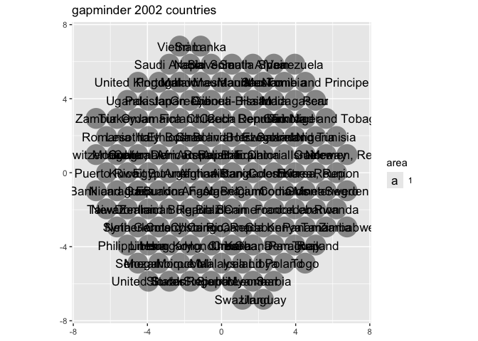
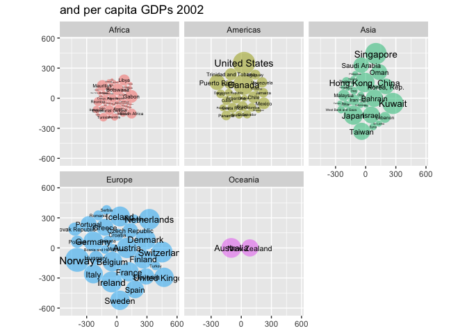
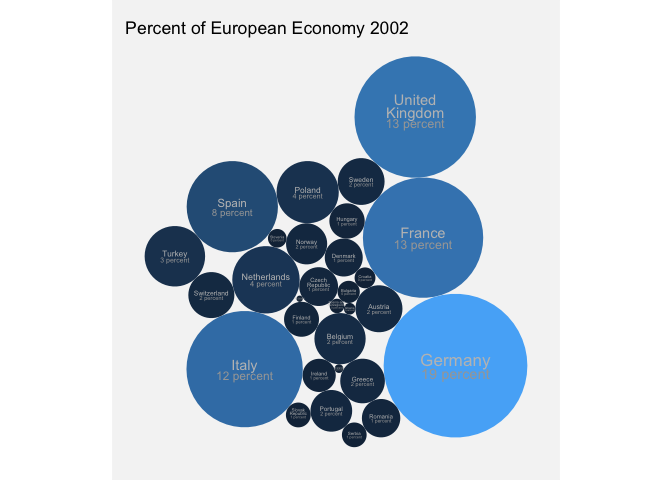
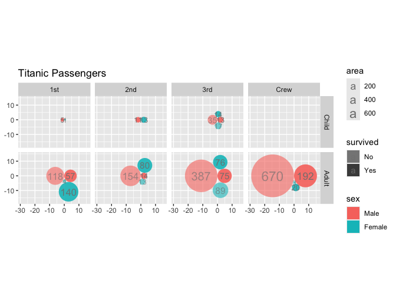

- [ggcirclepack](#ggcirclepack)
  - [Note to the reader](#note-to-the-reader)
- [status quo *without* {ggcirclepack}: precomputation required to
  create two more data
  frames](#status-quo-without-ggcirclepack-precomputation-required-to-create-two-more-data-frames)
- [Proposed UI](#proposed-ui)
- [Package functions](#package-functions)
  - [geom_circlepack_text (center)](#geom_circlepack_text-center)
    - [Step 1. compute panel](#step-1-compute-panel)
    - [Step 1.1 test compute](#step-11-test-compute)
    - [Step 2 and 3 ggproto and geom](#step-2-and-3-ggproto-and-geom)
    - [Step 4. test geom](#step-4-test-geom)
  - [geom_circlepack](#geom_circlepack)
    - [Step 1. compute_panel](#step-1-compute_panel)
    - [Step 1.1. test compute](#step-11-test-compute-1)
    - [Step 2 & 3 ggproto and geom](#step-2--3-ggproto-and-geom)
    - [Step 4. test geom](#step-4-test-geom-1)
- [Package the functions](#package-the-functions)
- [Issues](#issues)
  - [More computation under the hood for a count data
    case.](#more-computation-under-the-hood-for-a-count-data-case)

<!-- README.md is generated from README.Rmd. Please edit that file -->

# ggcirclepack

<!-- badges: start -->
<!-- badges: end -->

circle pack is an experimental package that uses the {packcircles}
package to handle circle packing computation.

### Note to the reader

Your feedback is on this work is greatly appreciated.

Beyond the descriptions of our work, we interject comments on our
hesitations 🤔 and areas that need some work 🚧, for your consideration
marked with emoji.

Your help and feedback would be greatly appreciated on any of the
questions…

- Are functions named intuitively? *‘According to IBM studies, intuitive
  variable naming contributes more to code readability than comments, or
  for that matter, any other factor’ McConnell, S. Code complete*
- Do functions work as you expect?
- Is there rewriting that could make the code more concise?
- What tests should be performed?

# status quo *without* {ggcirclepack}: precomputation required to create two more data frames

``` r
library(tidyverse)
#> ── Attaching core tidyverse packages ──────────────────────── tidyverse 2.0.0 ──
#> ✔ dplyr     1.1.4          ✔ readr     2.1.5     
#> ✔ forcats   1.0.0          ✔ stringr   1.5.1     
#> ✔ ggplot2   3.5.1.9000     ✔ tibble    3.2.1     
#> ✔ lubridate 1.9.3          ✔ tidyr     1.3.1     
#> ✔ purrr     1.0.2          
#> ── Conflicts ────────────────────────────────────────── tidyverse_conflicts() ──
#> ✖ dplyr::filter() masks stats::filter()
#> ✖ dplyr::lag()    masks stats::lag()
#> ℹ Use the conflicted package (<http://conflicted.r-lib.org/>) to force all conflicts to become errors
gapminder::gapminder %>%  
  filter(continent == "Americas") %>%  
  filter(year == 2002) %>%  
  select(country, pop) %>% 
  mutate(id = row_number()) ->  
df_w_id

packcircles::circleProgressiveLayout(df_w_id$pop,  
                                         sizetype = 'area') ->  
x0y0radius  

x0y0radius %>%  
  packcircles::circleLayoutVertices(npoints = 50) ->  
circle_outlines  

circle_outlines %>% 
  left_join(df_w_id) %>% 
  ggplot() +  
  aes(x = x, y = y) +  
  geom_polygon(colour = "black", alpha = 0.6) +  
  aes(group = id) +  
  aes(fill = pop) +  
  geom_text(data = cbind(df_w_id, x0y0radius),  
            aes(x, y, size = pop, label = country,  
                group = NULL, fill = NULL)) +  
  theme(legend.position = "none") +  
  coord_equal()
#> Joining with `by = join_by(id)`
```


# Proposed UI

``` r
library(tidyverse)
library(ggcirclepack)

gapminder::gapminder %>%
filter(year == 2002) %>%
  ggplot() +
  aes(id = country, area = pop) +
  geom_circlepack() +               # draws packed circles 
  geom_circlepack_text() +          # labels at the center
  coord_fixed(ratio = 1)
```

# Package functions

## geom_circlepack_text (center)

### Step 1. compute panel

``` r
compute_panel_aggregation <- function(data, scales, fun = sum){
  
    if(is.null(data$slice)){data$slice <- TRUE}

  data %>% 
    dplyr::filter(.data$slice) ->
  data
  
  grp_cols <-  c("id", "fill", "alpha", 
                 "colour", "group", "linewidth", 
                 "label", "size",
                 "linetype", "render")
  
  # Thanks June! https://github.com/teunbrand/ggplot-extension-club/discussions/15
  data %>% 
    group_by(group_by(pick(any_of(grp_cols)))) ->   
  data
  
  if(is.null(data$area)){data <- mutate(data, area = 1)}
  if(is.null(data$wt)){data$wt <- 1}
  
  data %>% 
    summarize(area = fun(.data$area*.data$wt), .groups = 'drop') ->
  data
    
  if(is.null(data$within)){data$within <- 1}

  data %>%   
    group_by(.data$within) %>% 
    mutate(prop = .data$area/sum(.data$area)) %>%
    mutate(percent = round(.data$prop*100)) -> 
  data
  
  data
  
}

#' compute_panel_circlepack_center
#'
#' @return
#' @export
#'
#' @examples
compute_panel_circlepack_center <- function(data, scales, fun = sum){

  # get aes names as they appear in the data
  
 data <- data |> compute_panel_aggregation(fun = fun) 
  
  
  data %>%   
    arrange(id)  -> # this doesn't feel very principled; motivation is when you go from no fill to color, preserves circle position...
  data  
  
  data %>%
    pull(area) %>%
    packcircles::circleProgressiveLayout(
      sizetype = 'area') %>%
    cbind(data) ->
  data
  
  
  if(!is.null(data$render)){
    
    data %>% 
      filter(.data$render) ->
    data
    
  }
  
  data
}
```

### Step 1.1 test compute

``` r
gapminder::gapminder %>%
filter(continent == "Americas") %>%
  filter(year == 2002) %>%
  # input must have required aesthetic inputs as columns
  select(area = pop, id = country) %>%
  compute_panel_circlepack_center() %>%
  head()
#>           x         y   radius        id      area within        prop percent
#> 1 -3493.018     0.000 3493.018 Argentina  38331121      1 0.045107495       5
#> 2  1639.564     0.000 1639.564   Bolivia   8445134      1 0.009938109       1
#> 3  2732.774 -9142.026 7567.594    Brazil 179914212      1 0.211720380      21
#> 4  1150.752  4801.407 3186.661    Canada  31902268      1 0.037542116       4
#> 5  5273.817  1302.381 2221.005     Chile  15497046      1 0.018236694       2
#> 6 10562.330 -1160.651 3612.938  Colombia  41008227      1 0.048257874       5

gapminder::gapminder %>% 
  filter(year == 2002) %>% 
  select(id = continent) %>% 
  compute_panel_circlepack_center()
#>            x         y    radius       id area within       prop percent
#> 1 -4.0684289  0.000000 4.0684289   Africa   52      1 0.36619718      37
#> 2  2.8209479  0.000000 2.8209479 Americas   25      1 0.17605634      18
#> 3  0.5868621 -5.635277 3.2410224     Asia   33      1 0.23239437      23
#> 4  0.5595510  5.461472 3.0901936   Europe   30      1 0.21126761      21
#> 5  3.8910939  3.456984 0.7978846  Oceania    2      1 0.01408451       1

gapminder::gapminder %>% 
  filter(year == 2002) %>% 
  mutate( render = country == "Argentina") %>% 
  select(id = continent, render) %>% 
  compute_panel_circlepack_center()
#>           x         y    radius       id render area within        prop percent
#> 1 0.1077182 -2.005231 0.5641896 Americas   TRUE    1      1 0.007042254       1

gapminder::gapminder %>% 
  # filter(year == 2002) %>% 
  mutate( render = country == "Argentina") %>% 
  select(id = continent, render, area = pop) %>% 
  compute_panel_circlepack_center(fun = mean)
#>           x         y   radius       id render     area within      prop
#> 1 -666.0431 -4663.549 3017.346 Americas   TRUE 28602240      1 0.1723697
#>   percent
#> 1      17
```

### Step 2 and 3 ggproto and geom

``` r
StatCirclepackcenter <- ggplot2::ggproto(`_class` = "StatCirclepackcenter",
                                  `_inherit` = ggplot2::Stat,
                                  required_aes = c("id"),
                                  compute_panel = compute_panel_circlepack_center,
                                  default_aes = ggplot2::aes(group = after_stat(id),
                                                             size = after_stat(area),
                                                             label = after_stat(id))
                                  )


#' Title
#'
#' @param mapping
#' @param data
#' @param position
#' @param na.rm
#' @param show.legend
#' @param inherit.aes
#' @param ...
#'
#' @return
#' @export
#'
#' @examples
stat_circlepack_center <- function(mapping = NULL, data = NULL,
                                 geom = "text",
                           position = "identity", na.rm = FALSE,
                           show.legend = NA,
                           inherit.aes = TRUE, ...) {
  ggplot2::layer(
    geom = geom, # inherit other behavior
    stat = StatCirclepackcenter, # proto object from Step 2
    data = data,
    mapping = mapping,
    position = position,
    show.legend = show.legend,
    inherit.aes = inherit.aes,
    params = list(na.rm = na.rm, ...)
  )
}


#' Title
#'
#' @param mapping
#' @param data
#' @param position
#' @param na.rm
#' @param show.legend
#' @param inherit.aes
#' @param ...
#'
#' @return
#' @export
#'
#' @examples
geom_circlepack_text <- stat_circlepack_center
```

### Step 4. test geom

``` r
gapminder::gapminder %>%
filter(year == 2002) %>%
  ggplot() +
  aes(id = country, area = pop) +
  geom_circlepack_text(alpha = .5) + 
  coord_equal() + 
  labs(title = "gapminder 2002 countries")
```


``` r

last_plot() + 
  aes(render = pop > 20000000)
```


``` r


layer_data()
#>        size            group            label PANEL render               id
#> 1  1.305966      Afghanistan      Afghanistan     1   TRUE      Afghanistan
#> 2  1.461572          Algeria          Algeria     1   TRUE          Algeria
#> 3  1.593993        Argentina        Argentina     1   TRUE        Argentina
#> 4  2.511332       Bangladesh       Bangladesh     1   TRUE       Bangladesh
#> 5  2.778300           Brazil           Brazil     1   TRUE           Brazil
#> 6  1.474611           Canada           Canada     1   TRUE           Canada
#> 7  6.000000            China            China     1   TRUE            China
#> 8  1.637143         Colombia         Colombia     1   TRUE         Colombia
#> 9  1.831346 Congo, Dem. Rep. Congo, Dem. Rep.     1   TRUE Congo, Dem. Rep.
#> 10 2.023224            Egypt            Egypt     1   TRUE            Egypt
#> 11 1.969799         Ethiopia         Ethiopia     1   TRUE         Ethiopia
#> 12 1.883928           France           France     1   TRUE           France
#> 13 2.107400          Germany          Germany     1   TRUE          Germany
#> 14 1.000000            Ghana            Ghana     1   TRUE            Ghana
#> 15 5.484858            India            India     1   TRUE            India
#> 16 2.944324        Indonesia        Indonesia     1   TRUE        Indonesia
#> 17 1.959111             Iran             Iran     1   TRUE             Iran
#> 18 1.261690             Iraq             Iraq     1   TRUE             Iraq
#> 19 1.861209            Italy            Italy     1   TRUE            Italy
#> 20 2.453839            Japan            Japan     1   TRUE            Japan
#> 21 1.463711            Kenya            Kenya     1   TRUE            Kenya
#> 22 1.181747 Korea, Dem. Rep. Korea, Dem. Rep.     1   TRUE Korea, Dem. Rep.
#> 23 1.737618      Korea, Rep.      Korea, Rep.     1   TRUE      Korea, Rep.
#> 24 1.204700         Malaysia         Malaysia     1   TRUE         Malaysia
#> 25 2.275058           Mexico           Mexico     1   TRUE           Mexico
#> 26 1.459000          Morocco          Morocco     1   TRUE          Morocco
#> 27 1.705004          Myanmar          Myanmar     1   TRUE          Myanmar
#> 28 1.325009            Nepal            Nepal     1   TRUE            Nepal
#> 29 2.404093          Nigeria          Nigeria     1   TRUE          Nigeria
#> 30 2.623663         Pakistan         Pakistan     1   TRUE         Pakistan
#> 31 1.351285             Peru             Peru     1   TRUE             Peru
#> 32 2.113159      Philippines      Philippines     1   TRUE      Philippines
#> 33 1.598898           Poland           Poland     1   TRUE           Poland
#> 34 1.191786          Romania          Romania     1   TRUE          Romania
#> 35 1.279996     Saudi Arabia     Saudi Arabia     1   TRUE     Saudi Arabia
#> 36 1.688421     South Africa     South Africa     1   TRUE     South Africa
#> 37 1.623675            Spain            Spain     1   TRUE            Spain
#> 38 1.572892            Sudan            Sudan     1   TRUE            Sudan
#> 39 1.194351           Taiwan           Taiwan     1   TRUE           Taiwan
#> 40 1.527887         Tanzania         Tanzania     1   TRUE         Tanzania
#> 41 1.915704         Thailand         Thailand     1   TRUE         Thailand
#> 42 1.963251           Turkey           Turkey     1   TRUE           Turkey
#> 43 1.288318           Uganda           Uganda     1   TRUE           Uganda
#> 44 1.883787   United Kingdom   United Kingdom     1   TRUE   United Kingdom
#> 45 3.302331    United States    United States     1   TRUE    United States
#> 46 1.272312        Venezuela        Venezuela     1   TRUE        Venezuela
#> 47 2.094400          Vietnam          Vietnam     1   TRUE          Vietnam
#>          area          x           y    radius within        prop percent
#> 1    25268405  -2836.051      0.0000  2836.051      1 0.004292254       0
#> 2    31287142   1442.390  -4194.8885  3155.789      1 0.005314636       1
#> 3    38331121   5786.203    838.7913  3493.018      1 0.006511172       1
#> 4   135656790 -10562.150   5366.9438  6571.217      1 0.023043538       2
#> 5   179914212   6304.785 -13752.5065  7567.594      1 0.030561389       3
#> 6    31902268  12117.233   2968.6196  3186.661      1 0.005419125       1
#> 7  1280400000 -25094.786 -17102.3603 20188.214      1 0.217497006      22
#> 8    41008227   5474.339  11629.9084  3612.938      1 0.006965922       1
#> 9    55379852  -1355.285 -22683.6785  4198.566      1 0.009407179       1
#> 10   73312559 -21725.233   7688.6560  4830.747      1 0.012453344       1
#> 11   67946797 -10136.746  17045.0432  4650.606      1 0.011541881       1
#> 12   59925035  19670.475   2853.2253  4367.463      1 0.010179253       1
#> 13   82350671   5427.583  20362.5882  5119.866      1 0.013988616       1
#> 14   20550751  10750.391  14829.7966  2557.637      1 0.003490883       0
#> 15 1034172547  31588.647 -18420.2356 18143.521      1 0.175671222      18
#> 16  211060000   8213.969 -30561.9288  8196.492      1 0.035852014       4
#> 17   66907826  21083.729  11723.7263  4614.913      1 0.011365395       1
#> 18   24001816  26740.332   1917.4309  2764.058      1 0.004077103       0
#> 19   57926999 -19059.189  16415.2732  4294.035      1 0.009839854       1
#> 20  127065841  16534.838  23262.6391  6359.742      1 0.021584224       2
#> 21   31386842  -3792.076  25052.4818  3160.814      1 0.005331572       1
#> 22   22215365 -15272.351  22246.8597  2659.205      1 0.003773645       0
#> 23   47969150 -10619.817  26881.1207  3907.564      1 0.008148349       1
#> 24   22662365  10947.596  30376.3580  2685.825      1 0.003849576       0
#> 25  102479927  -5308.329 -33814.2536  5711.425      1 0.017407902       2
#> 26   31167783 -29680.800   7058.1768  3149.764      1 0.005294361       1
#> 27   45598081 -26922.413  18375.1972  3809.766      1 0.007745584       1
#> 28   25873917  27970.896   8793.1457  2869.830      1 0.004395111       0
#> 29  119901274 -22500.653  27330.6653  6177.844      1 0.020367204       2
#> 30  153403524  -4755.728  37001.8314  6987.836      1 0.026058112       3
#> 31   26769436  33228.351   2578.4345  2919.071      1 0.004547229       0
#> 32   82995088 -16882.452  37155.4418  5139.860      1 0.014098081       1
#> 33   38625976   5004.131  33145.0563  3506.427      1 0.006561258       1
#> 34   22404337  18803.808  32003.1696  2670.491      1 0.003805745       0
#> 35   24501530  25197.763  26215.7083  2792.683      1 0.004161988       0
#> 36   44433622 -34121.795  16033.7296  3760.806      1 0.007547782       1
#> 37   40152517  36639.232   8104.6836  3575.044      1 0.006820566       1
#> 38   37090298 -18047.874 -39651.0916  3436.016      1 0.006300397       1
#> 39   22454239 -35259.895 -37579.8322  2673.463      1 0.003814222       0
#> 40   34593779 -40567.220 -34798.7725  3318.364      1 0.005876323       1
#> 41   62806748 -46358.794 -29589.5839  4471.242      1 0.010668760       1
#> 42   67308928 -49790.993 -14657.3976  4628.725      1 0.011433529       1
#> 43   24739869 -46259.905  -8114.4605  2806.233      1 0.004202474       0
#> 44   59912431 -43918.269  -1334.1902  4367.003      1 0.010177112       1
#> 45  287675526 -46911.443  12276.8062  9569.220      1 0.048866421       5
#> 46   24287670  32717.147  15684.1439  2780.469      1 0.004125660       0
#> 47   80908147  19176.278 -38042.2826  5074.826      1 0.013743580       1
#>    colour family angle hjust vjust alpha fontface lineheight
#> 1   black            0   0.5   0.5   0.5        1        1.2
#> 2   black            0   0.5   0.5   0.5        1        1.2
#> 3   black            0   0.5   0.5   0.5        1        1.2
#> 4   black            0   0.5   0.5   0.5        1        1.2
#> 5   black            0   0.5   0.5   0.5        1        1.2
#> 6   black            0   0.5   0.5   0.5        1        1.2
#> 7   black            0   0.5   0.5   0.5        1        1.2
#> 8   black            0   0.5   0.5   0.5        1        1.2
#> 9   black            0   0.5   0.5   0.5        1        1.2
#> 10  black            0   0.5   0.5   0.5        1        1.2
#> 11  black            0   0.5   0.5   0.5        1        1.2
#> 12  black            0   0.5   0.5   0.5        1        1.2
#> 13  black            0   0.5   0.5   0.5        1        1.2
#> 14  black            0   0.5   0.5   0.5        1        1.2
#> 15  black            0   0.5   0.5   0.5        1        1.2
#> 16  black            0   0.5   0.5   0.5        1        1.2
#> 17  black            0   0.5   0.5   0.5        1        1.2
#> 18  black            0   0.5   0.5   0.5        1        1.2
#> 19  black            0   0.5   0.5   0.5        1        1.2
#> 20  black            0   0.5   0.5   0.5        1        1.2
#> 21  black            0   0.5   0.5   0.5        1        1.2
#> 22  black            0   0.5   0.5   0.5        1        1.2
#> 23  black            0   0.5   0.5   0.5        1        1.2
#> 24  black            0   0.5   0.5   0.5        1        1.2
#> 25  black            0   0.5   0.5   0.5        1        1.2
#> 26  black            0   0.5   0.5   0.5        1        1.2
#> 27  black            0   0.5   0.5   0.5        1        1.2
#> 28  black            0   0.5   0.5   0.5        1        1.2
#> 29  black            0   0.5   0.5   0.5        1        1.2
#> 30  black            0   0.5   0.5   0.5        1        1.2
#> 31  black            0   0.5   0.5   0.5        1        1.2
#> 32  black            0   0.5   0.5   0.5        1        1.2
#> 33  black            0   0.5   0.5   0.5        1        1.2
#> 34  black            0   0.5   0.5   0.5        1        1.2
#> 35  black            0   0.5   0.5   0.5        1        1.2
#> 36  black            0   0.5   0.5   0.5        1        1.2
#> 37  black            0   0.5   0.5   0.5        1        1.2
#> 38  black            0   0.5   0.5   0.5        1        1.2
#> 39  black            0   0.5   0.5   0.5        1        1.2
#> 40  black            0   0.5   0.5   0.5        1        1.2
#> 41  black            0   0.5   0.5   0.5        1        1.2
#> 42  black            0   0.5   0.5   0.5        1        1.2
#> 43  black            0   0.5   0.5   0.5        1        1.2
#> 44  black            0   0.5   0.5   0.5        1        1.2
#> 45  black            0   0.5   0.5   0.5        1        1.2
#> 46  black            0   0.5   0.5   0.5        1        1.2
#> 47  black            0   0.5   0.5   0.5        1        1.2
```

## geom_circlepack

### Step 1. compute_panel

``` r
# Step 1
#' compute_panel_circlepack
#'
#' @param data
#' @param scales
#'
#' @return
#' @export
#'
#' @examples
compute_panel_circlepack <- function(data, scales, npoints = 50, fun = sum){

  data <- data |> compute_panel_aggregation(scales, fun)

  data %>%   
    arrange(id)  -> # this doesn't feel very principled; motivation is when you go from no fill to color, preserves circle position...
  data
  
  data$id = 1:nrow(data)

  data %>%
    pull(area) %>%
    packcircles::circleProgressiveLayout(
      sizetype = 'area') %>%
    packcircles::circleLayoutVertices(npoints = npoints) %>%
    left_join(data, by = join_by(id)) 

}
```

### Step 1.1. test compute

``` r
gapminder::gapminder %>%
filter(continent == "Americas") %>%
  filter(year == 2002) %>%
  # input must have required aesthetic inputs as columns
  rename(id = country, area = pop) %>%
  compute_panel_circlepack() %>%
  head()
#>            x         y id     area within      prop percent
#> 1    0.00000    0.0000  1 38331121      1 0.0451075       5
#> 2  -27.54349  437.7912  1 38331121      1 0.0451075       5
#> 3 -109.73958  868.6783  1 38331121      1 0.0451075       5
#> 4 -245.29200 1285.8657  1 38331121      1 0.0451075       5
#> 5 -432.06299 1682.7743  1 38331121      1 0.0451075       5
#> 6 -667.10708 2053.1445  1 38331121      1 0.0451075       5
```

### Step 2 & 3 ggproto and geom

``` r
StatCirclepack <- ggplot2::ggproto(`_class` = "StatCirclepack",
                                  `_inherit` = ggplot2::Stat,
                                  required_aes = c("id"),
                                  compute_panel = compute_panel_circlepack,
                                  default_aes = ggplot2::aes(group = after_stat(id))
                                  )

#' Title
#'
#' @param mapping
#' @param data
#' @param position
#' @param na.rm
#' @param show.legend
#' @param inherit.aes
#' @param ...
#'
#' @return
#' @export
#'
#' @examples
geom_circlepack <- function(mapping = NULL, data = NULL,
                           position = "identity", na.rm = FALSE,
                           show.legend = NA,
                           inherit.aes = TRUE, ...) {
  ggplot2::layer(
    stat = StatCirclepack, # proto object from Step 2
    geom = ggplot2::GeomPolygon, # inherit other behavior
    data = data,
    mapping = mapping,
    position = position,
    show.legend = show.legend,
    inherit.aes = inherit.aes,
    params = list(na.rm = na.rm, ...)
  )
}
```

### Step 4. test geom

``` r


gapminder::gapminder %>%
filter(year == 2002) %>%
  ggplot() +
  aes(id = country) +
  geom_circlepack(alpha = .5) + 
  geom_circlepack_text() +
  coord_equal() + 
  labs(title = "gapminder 2002 countries")
```



``` r

last_plot() +
  aes(fill = continent) + 
  labs(title = "from 5 continents")
```


``` r

last_plot() +
  aes(area = pop) + 
  labs(title = "with very different populations")
```


``` r

last_plot() +
  facet_wrap(facets = vars(continent)) + 
  labs(title = "faceting")
```


``` r

last_plot() + 
  scale_size_continuous(range = c(0, 4)) + 
  theme(legend.position = "none") + 
  labs(title = "remove legends")
```


``` r

last_plot() + 
  aes(area = gdpPercap*pop) + 
  labs(title = "and very different GDPs")
```


``` r

last_plot() + 
  aes(area = gdpPercap) + 
  labs(title = "and per capita GDPs 2002")
```



``` r

last_plot() + 
  aes(slice = continent == "Europe") + 
  facet_null() + 
  aes(fill = after_stat(area)) + 
  aes(label = paste0(country, "\n$", round(gdpPercap)))
```


``` r


gapminder::gapminder %>%
filter(year == 2002, 
       continent == "Europe") %>%
  ggplot() +
  aes(id = country, area = pop*gdpPercap) +
  geom_circlepack() + 
  geom_circlepack_text(vjust = 0, color = "grey75",
                       lineheight = .7) +
  aes(label = str_wrap(country, 10)) +
  coord_equal() + 
  scale_size(range = c(.5,4.5)) +
  aes(slice = continent == "Europe") +
  labs(title = "Percent of European Economy 2002") + 
  aes(fill = after_stat(area)) + 
  geom_circlepack_text(vjust = 1.2, color = "grey65",
                       aes(label = paste(after_stat(percent),
                                         "percent"), 
                           size = stage(after_stat = area,
                                        after_scale = size*.85))) +
  ggstamp::theme_void_fill("whitesmoke") +
  theme(legend.position = "none")
```



``` r
  
pride_index <- readr::read_csv('https://raw.githubusercontent.com/rfordatascience/tidytuesday/master/data/2024/2024-06-11/pride_index.csv')
#> Rows: 238 Columns: 5
#> ── Column specification ────────────────────────────────────────────────────────
#> Delimiter: ","
#> chr (3): campus_name, campus_location, community_type
#> dbl (2): rating, students
#> 
#> ℹ Use `spec()` to retrieve the full column specification for this data.
#> ℹ Specify the column types or set `show_col_types = FALSE` to quiet this message.

comm_types <- c("large urban city",
                "medium city",
                "small city",
                "small town",
                "very small town",
                "rural community")

pride_it <- pride_index %>% 
  # fix a typo
  mutate(campus_location = str_replace(campus_location, "Swarrthmore", "Swarthmore")) %>% 
  mutate(community_type = fct_relevel(community_type, comm_types)) %>% 
  mutate(state = str_sub(campus_location, -2, -1)) %>% 
  mutate(campus_name = str_replace(campus_name, "University", "U"))

ggplot(pride_it) +
  aes(id = campus_name) + 
  aes(area = students) + 
  aes(fill = rating == 5) +
  geom_circlepack(linewidth = 0.2, color = "grey99") +
  aes(label = str_wrap(after_stat(id), 10)) +
  stat_circlepack_center(geom = GeomText, 
                         lineheight = .8) +
  scale_size(range = c(0,2)) +
  aes(size = students*as.numeric(rating == 5)) + # freshly working
  facet_wrap(facets = vars(community_type))
```


``` r
gapminder::gapminder %>%
filter(year == 2002) %>%
  ggplot() +
  aes(id = country) +
  geom_circlepack(alpha = .5) + 
  coord_equal() +
  aes(area = pop) + 
  geom_circlepack_text(aes(label = after_stat(
    paste(id, "\n",
    round(area/1000000, 1), "mil."))), lineheight = .8)
```


``` r

gapminder::gapminder %>%
filter(year == 2002) %>%
  ggplot() +
  aes(id = continent) + 
  geom_circlepack() +
  geom_circlepack_text(alpha = .5) + 
  coord_equal() +
  aes(fill = continent)
```


``` r

last_plot() + 
  aes(id = country)
```


``` r

last_plot() + 
  aes(area = pop)
```


``` r
 

last_plot() + 
  facet_wrap(~continent)
```


``` r


gapminder::gapminder %>%
filter(year == 2002) %>%
  ggplot() +
  aes(id = country) + 
  geom_circlepack() +
  geom_circlepack_text(alpha = .5) +
  aes(area = pop) + 
  coord_equal() + 
  aes(fill = continent) + 
  aes(render = pop > 20000000)
```


``` r

prop_by <- function(...) {
  area <- evalq(area, parent.frame())
  if (length(list(...)) == 0) {
    area / sum(area)
  } else {
    area / ave(area, ..., FUN = function(x) sum(abs(x)))
  }
}

last_plot() +
    aes(label = after_stat(scales::percent(prop_by("All"), 2)))
```


``` r

last_plot() +
    aes(label = after_stat(scales::percent(prop_by(fill), 2)))
```


``` r


# GeomTextRepel
gapminder::gapminder %>%
filter(year == 2002) %>%
  ggplot() +
  aes(id = country) + 
  geom_circlepack() +
  layer(geom = ggrepel::GeomTextRepel, 
        stat = StatCirclepackcenter, 
        position = "identity") +
  aes(area = pop) + 
  coord_equal() + 
  aes(fill = continent) + 
  aes(render = pop > 20000000)
```


``` r
gapminder::gapminder %>%
  ggplot() + 
  aes(id = country, area = pop) + 
  geom_circlepack(fun = mean) + 
  geom_circlepack_text(fun = mean) + 
  aes(label = paste(after_stat(id), "\n",
                    round(after_stat(area)/ 1000000), "million")) +
  labs(title = "Average Population - Millions from 1952-2012") + 
  aes(fill = I("plum2")) + 
  coord_equal()
```


``` r
mpg %>% 
  ggplot() + 
  aes(id = cyl, area = hwy) +
  geom_circlepack(fun = mean) + 
  geom_circlepack_text(fun = mean, lineheight = .8) + 
  scale_size(range = c(4,5)) + 
  labs(title = "Average highway MPG by number of cyl") + 
  coord_equal() + 
  aes(label = 
        after_stat(paste0(id,"cyl\n", 
                          round(area), "mpg"))) + 
  aes(fill = after_stat(area)) + 
  scale_fill_viridis_c(begin = .3, end = .7) 
```


# Package the functions

``` r
knitrExtra:::chunk_to_r(chunk_name = "compute_panel_circlepack")
#> It seems you are currently knitting a Rmd/Qmd file. The parsing of the file will be done in a new R session.
knitrExtra:::chunk_to_r(chunk_name = "geom_circlepack")
#> It seems you are currently knitting a Rmd/Qmd file. The parsing of the file will be done in a new R session.
knitrExtra:::chunk_to_r(chunk_name = "compute_panel_circlepack_center")
#> It seems you are currently knitting a Rmd/Qmd file. The parsing of the file will be done in a new R session.
knitrExtra:::chunk_to_r(chunk_name = "geom_circlepack_text")
#> It seems you are currently knitting a Rmd/Qmd file. The parsing of the file will be done in a new R session.
```

``` r
devtools::document()
devtools::check()
devtools::install(pkg = ".", upgrade = "never") 
```

# Issues

Wish list for ggcirclepack:

## More computation under the hood for a count data case.

``` r
tidytitanic::tidy_titanic %>% 
  head()
```

``` r
tidytitanic::tidy_titanic %>% 
  ggplot() + 
  aes(id = "all") + 
  geom_circlepack() +
  geom_circlepack_text(aes(label = after_stat(area)), color = "gray50") +
  coord_equal() + 
  labs(title = "Titanic Passengers")
```


``` r

layer_data(i = 2)
#>       size label group PANEL  id         x y   radius area within prop percent
#> 1 4.535534  2201   all     1 all -26.46885 0 26.46885 2201      1    1     100
#>   colour family angle hjust vjust alpha fontface lineheight
#> 1 gray50            0   0.5   0.5    NA        1        1.2

last_plot() +
  aes(fill = sex) +
  scale_size(range = c(3, 6))
```


``` r

last_plot() + 
  aes(alpha = survived) +
  scale_alpha_discrete(range = c(.6,.9))
```


``` r

last_plot() + 
  facet_wrap(~class)
```


``` r

last_plot() + 
  facet_grid(age ~ class)
```


