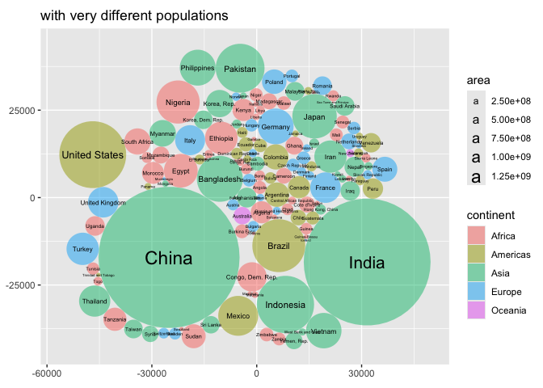

  - [ggcirclepack](#ggcirclepack)
      - [Note to the reader](#note-to-the-reader)
  - [status quo w/o {ggcirclepack}: precomputation required to two more
    data
    frames](#status-quo-wo-ggcirclepack-precomputation-required-to-two-more-data-frames)
  - [Proposed UI](#proposed-ui)
  - [Package functions](#package-functions)
      - [geom\_circlepack\_text (center)](#geom_circlepack_text-center)
          - [Step 1. compute panel](#step-1-compute-panel)
          - [Step 1.1 test compute](#step-11-test-compute)
          - [Step 2 and 3 ggproto and
            geom](#step-2-and-3-ggproto-and-geom)
          - [Step 4. test geom](#step-4-test-geom)
      - [geom\_circlepack](#geom_circlepack)
          - [Step 1. compute\_panel](#step-1-compute_panel)
          - [Step 1.1. test compute](#step-11-test-compute-1)
          - [Step 2 & 3 ggproto and geom](#step-2--3-ggproto-and-geom)
          - [Step 4. test geom](#step-4-test-geom-1)
  - [Package the functions](#package-the-functions)
  - [Issues](#issues)
      - [More computation under the hood for a count data
        case.](#more-computation-under-the-hood-for-a-count-data-case)
      - [Quiet the joins.](#quiet-the-joins)
      - [create a ggcirclepack()/defaults\_circlepack() function for
        preferred
        defaults.](#create-a-ggcirclepackdefaults_circlepack-function-for-preferred-defaults)

<!-- README.md is generated from README.Rmd. Please edit that file -->

# ggcirclepack

<!-- badges: start -->

<!-- badges: end -->

circle pack is an experimental package that uses the {packcircles}
package to handle circle packing computation.

### Note to the reader

Your feedback is on this work is greatly appreciated.

Beyond the descriptions of our work, we interject comments on our
hesitations 🤔 and areas that need some work 🚧, for your consideration
marked with emoji.

Your help and feedback would be greatly appreciated on any of the
questions…

  - Are functions named intuitively? *‘According to IBM studies,
    intuitive variable naming contributes more to code readability than
    comments, or for that matter, any other factor’ McConnell, S. Code
    complete*
  - Do functions work as you expect?
  - Is there rewriting that could make the code more concise?
  - What tests should be performed?

# status quo w/o {ggcirclepack}: precomputation required to two more data frames

``` r
library(tidyverse)
#> ── Attaching core tidyverse packages ──────────────────────── tidyverse 2.0.0 ──
#> ✔ dplyr     1.1.4     ✔ readr     2.1.5
#> ✔ forcats   1.0.0     ✔ stringr   1.5.1
#> ✔ ggplot2   3.5.1     ✔ tibble    3.2.1
#> ✔ lubridate 1.9.3     ✔ tidyr     1.3.1
#> ✔ purrr     1.0.2     
#> ── Conflicts ────────────────────────────────────────── tidyverse_conflicts() ──
#> ✖ dplyr::filter() masks stats::filter()
#> ✖ dplyr::lag()    masks stats::lag()
#> ℹ Use the conflicted package (<http://conflicted.r-lib.org/>) to force all conflicts to become errors
gapminder::gapminder %>%  
  filter(continent == "Americas") %>%  
  filter(year == 2002) %>%  
  select(country, pop) %>% 
  mutate(id = row_number()) ->  
df_w_id

packcircles::circleProgressiveLayout(df_w_id$pop,  
                                         sizetype = 'area') ->  
x0y0radius  

x0y0radius %>%  
  packcircles::circleLayoutVertices(npoints = 50) ->  
circle_outlines  

circle_outlines %>% 
  left_join(df_w_id) %>% 
  ggplot() +  
  aes(x = x, y = y) +  
  geom_polygon(colour = "black", alpha = 0.6) +  
  aes(group = id) +  
  aes(fill = pop) +  
  geom_text(data = cbind(df_w_id, x0y0radius),  
            aes(x, y, size = pop, label = country,  
                group = NULL, fill = NULL)) +  
  theme(legend.position = "none") +  
  coord_equal()
#> Joining with `by = join_by(id)`
```


# Proposed UI

``` r
library(tidyverse)
library(ggcirclepack)

gapminder::gapminder %>%
filter(year == 2002) %>%
  ggplot() +
  aes(id = country, area = pop) +
  geom_circlepack() +               # draws packed circles 
  geom_circlepack_text() +          # labels at the center
  coord_fixed(ratio = 1)
```

# Package functions

## geom\_circlepack\_text (center)

### Step 1. compute panel

``` r
#' compute_panel_circlepack_center
#'
#' @return
#' @export
#'
#' @examples
#' # TBD
compute_panel_circlepack_center <- function(data, scales, count = F){

  # data ->
  #   data1
  
  
  
  if(is.null(data$area)){data$area <- 1}
  
   # if(!("weight" %in% names(data))){data$weight <- 1}
  # order matters... Need to add text aesthetics
  if("id" %in% names(data)){data <- group_by(data, id, .add = T)}
  if("fill" %in% names(data)){data <- group_by(data, fill, .add = T)}
  if("alpha" %in% names(data)){data <- group_by(data, alpha, .add = T)}
  if("colour" %in% names(data)){data <- group_by(data, colour, .add = T)}
  if("group" %in% names(data)){data <- group_by(data, group, .add = T)}
  if("linetype" %in% names(data)){data <- group_by(data, linetype, .add = T)}
  if("linewidth" %in% names(data)){data <- group_by(data, linewidth, .add = T)}
  
  
  if(count){
  data %>% 
    count(wt = area) %>% 
    rename(area = n) ->
    data
  }

  data %>%
    pull(area) %>%
    packcircles::circleProgressiveLayout(
      sizetype = 'area') %>%
    cbind(data) %>%
    mutate(label = id)

}
```

### Step 1.1 test compute

``` r
gapminder::gapminder %>%
filter(continent == "Americas") %>%
  filter(year == 2002) %>%
  # input must have required aesthetic inputs as columns
  select(area = pop, id = country) %>%
  compute_panel_circlepack_center() %>%
  head()
#>           x         y   radius      area        id     label
#> 1 -3493.018     0.000 3493.018  38331121 Argentina Argentina
#> 2  1639.564     0.000 1639.564   8445134   Bolivia   Bolivia
#> 3  2732.774 -9142.026 7567.594 179914212    Brazil    Brazil
#> 4  1150.752  4801.407 3186.661  31902268    Canada    Canada
#> 5  5273.817  1302.381 2221.005  15497046     Chile     Chile
#> 6 10562.330 -1160.651 3612.938  41008227  Colombia  Colombia

gapminder::gapminder %>% 
  filter(year == 2002) %>% 
  select(id = continent) %>% 
  compute_panel_circlepack_center(count = T)
#> Warning: Unknown or uninitialised column: `area`.
#>            x         y    radius       id area    label
#> 1 -4.0684289  0.000000 4.0684289   Africa   52   Africa
#> 2  2.8209479  0.000000 2.8209479 Americas   25 Americas
#> 3  0.5868621 -5.635277 3.2410224     Asia   33     Asia
#> 4  0.5595510  5.461472 3.0901936   Europe   30   Europe
#> 5  3.8910939  3.456984 0.7978846  Oceania    2  Oceania
```

### Step 2 and 3 ggproto and geom

``` r
StatCirclepackcenter <- ggplot2::ggproto(`_class` = "StatCirclepackcenter",
                                  `_inherit` = ggplot2::Stat,
                                  required_aes = c("id"),
                                  compute_panel = compute_panel_circlepack_center,
                                  default_aes = ggplot2::aes(group = after_stat(id),
                                                             size = after_stat(area))
                                  )


#' Title
#'
#' @param mapping
#' @param data
#' @param position
#' @param na.rm
#' @param show.legend
#' @param inherit.aes
#' @param ...
#'
#' @return
#' @export
#'
#' @examples
#' # TBD
geom_circlepack_text <- function(mapping = NULL, data = NULL,
                           position = "identity", na.rm = FALSE,
                           show.legend = NA,
                           inherit.aes = TRUE, ...) {
  ggplot2::layer(
    stat = StatCirclepackcenter, # proto object from Step 2
    geom = ggplot2::GeomText, # inherit other behavior
    data = data,
    mapping = mapping,
    position = position,
    show.legend = show.legend,
    inherit.aes = inherit.aes,
    params = list(na.rm = na.rm, ...)
  )
}
```

### Step 4. test geom

``` r
gapminder::gapminder %>%
filter(year == 2002) %>%
  ggplot() +
  aes(id = country, area = pop) +
  geom_circlepack_text(alpha = .5) + 
  coord_equal() + 
  labs(title = "gapminder 2002 countries")
```


## geom\_circlepack

### Step 1. compute\_panel

``` r
# Step 1
#' compute_panel_circlepack
#'
#' @param data
#' @param scales
#'
#' @return
#' @export
#'
#' @examples
#' TBD
compute_panel_circlepack <- function(data, scales, count = F){

  if(is.null(data$area)){data$area <- 1}
  
    if(is.null(data$area)){data$area <- 1}
  
   # if(!("weight" %in% names(data))){data$weight <- 1}
  # order matters... Need to add text aesthetics
  if("id" %in% names(data)){data <- group_by(data, id, .add = T)}

  if("fill" %in% names(data)){data <- group_by(data, fill, .add = T)}
  if("alpha" %in% names(data)){data <- group_by(data, alpha, .add = T)}
  if("colour" %in% names(data)){data <- group_by(data, colour, .add = T)}
  if("group" %in% names(data)){data <- group_by(data, group, .add = T)}
  if("linetype" %in% names(data)){data <- group_by(data, linetype, .add = T)}
  if("linewidth" %in% names(data)){data <- group_by(data, linewidth, .add = T)}
  
  if(count){
  data %>% 
    mutate(id = as.integer(as.factor(id))) %>% 
    count(wt = area) %>% 
    rename(area = n) ->
    data
  } else { data$id = 1:nrow(data)}
  
  # data %>%
  #   mutate(id = row_number()) ->
  #   data1

  # if(is.null(data$area)){
  # 
  #   data1 %>%
  #     mutate(area = 1) ->
  #     data1
  # 
  # }

  data %>%
    pull(area) %>%
    packcircles::circleProgressiveLayout(
      sizetype = 'area') %>%
    packcircles::circleLayoutVertices(npoints = 50) %>%
    left_join(data) #%>%

}
```

### Step 1.1. test compute

``` r
gapminder::gapminder %>%
filter(continent == "Americas") %>%
  filter(year == 2002) %>%
  # input must have required aesthetic inputs as columns
  rename(id = country, area = pop) %>%
  compute_panel_circlepack() %>%
  head()
#> Joining with `by = join_by(id)`
#>            x         y id continent year lifeExp     area gdpPercap
#> 1    0.00000    0.0000  1  Americas 2002   74.34 38331121  8797.641
#> 2  -27.54349  437.7912  1  Americas 2002   74.34 38331121  8797.641
#> 3 -109.73958  868.6783  1  Americas 2002   74.34 38331121  8797.641
#> 4 -245.29200 1285.8657  1  Americas 2002   74.34 38331121  8797.641
#> 5 -432.06299 1682.7743  1  Americas 2002   74.34 38331121  8797.641
#> 6 -667.10708 2053.1445  1  Americas 2002   74.34 38331121  8797.641
```

### Step 2 & 3 ggproto and geom

``` r
StatCirclepack <- ggplot2::ggproto(`_class` = "StatCirclepack",
                                  `_inherit` = ggplot2::Stat,
                                  required_aes = c("id"),
                                  compute_panel = compute_panel_circlepack,
                                  default_aes = ggplot2::aes(group = after_stat(id))
                                  )

#' Title
#'
#' @param mapping
#' @param data
#' @param position
#' @param na.rm
#' @param show.legend
#' @param inherit.aes
#' @param ...
#'
#' @return
#' @export
#'
#' @examples
#' # TBD
geom_circlepack <- function(mapping = NULL, data = NULL,
                           position = "identity", na.rm = FALSE,
                           show.legend = NA,
                           inherit.aes = TRUE, ...) {
  ggplot2::layer(
    stat = StatCirclepack, # proto object from Step 2
    geom = ggplot2::GeomPolygon, # inherit other behavior
    data = data,
    mapping = mapping,
    position = position,
    show.legend = show.legend,
    inherit.aes = inherit.aes,
    params = list(na.rm = na.rm, ...)
  )
}
```

### Step 4. test geom

``` r


gapminder::gapminder %>%
filter(year == 2002) %>%
  ggplot() +
  aes(id = country) +
  geom_circlepack(alpha = .5) + 
  coord_equal() + 
  labs(title = "gapminder 2002 countries")
#> Joining with `by = join_by(id)`
```


``` r

last_plot() +
  aes(fill = continent) + 
  labs(title = "from 5 continents")
#> Joining with `by = join_by(id)`
```


``` r

last_plot() +
  aes(area = pop) + 
  geom_circlepack_text() + 
  labs(title = "with very different populations")
#> Joining with `by = join_by(id)`
```



``` r

last_plot() +
  facet_wrap(facets = vars(continent)) + 
  labs(title = "faceting")
#> Joining with `by = join_by(id)`
#> Joining with `by = join_by(id)`
#> Joining with `by = join_by(id)`
#> Joining with `by = join_by(id)`
#> Joining with `by = join_by(id)`
```


``` r

last_plot() + 
  scale_size_continuous(range = c(0, 4)) + 
  theme(legend.position = "none") + 
  labs(title = "remove legends")
#> Joining with `by = join_by(id)`
#> Joining with `by = join_by(id)`
#> Joining with `by = join_by(id)`
#> Joining with `by = join_by(id)`
#> Joining with `by = join_by(id)`
```


``` r

last_plot() + 
  aes(area = gdpPercap*pop) + 
  labs(title = "and very different GDPs")
#> Joining with `by = join_by(id)`
#> Joining with `by = join_by(id)`
#> Joining with `by = join_by(id)`
#> Joining with `by = join_by(id)`
#> Joining with `by = join_by(id)`
```


``` r

last_plot() + 
  aes(area = gdpPercap) + 
  labs(title = "and per capita GDPs")
#> Joining with `by = join_by(id)`
#> Joining with `by = join_by(id)`
#> Joining with `by = join_by(id)`
#> Joining with `by = join_by(id)`
#> Joining with `by = join_by(id)`
```


``` r


gapminder::gapminder %>%
filter(year == 2002) %>%
  ggplot() +
  aes(id = country) +
  geom_circlepack(alpha = .5) + 
  coord_equal() +
  aes(area = pop) + 
  geom_circlepack_text(aes(label = after_stat(
    paste(id, "\n",
    round(area/1000000, 1), "mil."))), lineheight = .8)
#> Joining with `by = join_by(id)`
```


``` r


gapminder::gapminder %>%
filter(year == 2002) %>%
  ggplot() +
  aes(id = continent) + 
  geom_circlepack(count = T) +
  geom_circlepack_text(alpha = .5, count = T) + 
  coord_equal() +
  aes(fill = continent)
#> Joining with `by = join_by(id)`
```


``` r

last_plot() + 
  aes(id = country)
#> Joining with `by = join_by(id)`
```


``` r

last_plot() + 
  aes(area = pop)
#> Joining with `by = join_by(id)`
```


``` r
 

last_plot() + 
  facet_wrap(~continent)
#> Joining with `by = join_by(id)`
#> Joining with `by = join_by(id)`
#> Joining with `by = join_by(id)`
#> Joining with `by = join_by(id)`
#> Joining with `by = join_by(id)`
```


``` r


layer_data(i = 2)
#> Joining with `by = join_by(id)`
#> Joining with `by = join_by(id)`
#> Joining with `by = join_by(id)`
#> Joining with `by = join_by(id)`
#> Joining with `by = join_by(id)`
#>        fill     size                    group PANEL       area
#> 1   #F8766D 1.779513                  Algeria     1   31287142
#> 2   #F8766D 1.457016                   Angola     1   10866106
#> 3   #F8766D 1.365892                    Benin     1    7026113
#> 4   #F8766D 1.168849                 Botswana     1    1630347
#> 5   #F8766D 1.485707             Burkina Faso     1   12251209
#> 6   #F8766D 1.365758                  Burundi     1    7021078
#> 7   #F8766D 1.554752                 Cameroon     1   15929988
#> 8   #F8766D 1.275176 Central African Republic     1    4048013
#> 9   #F8766D 1.411358                     Chad     1    8835739
#> 10  #F8766D 1.093116                  Comoros     1     614382
#> 11  #F8766D 2.038324         Congo, Dem. Rep.     1   55379852
#> 12  #F8766D 1.248348              Congo, Rep.     1    3328795
#> 13  #F8766D 1.560404            Cote d'Ivoire     1   16252726
#> 14  #F8766D 1.073553                 Djibouti     1     447416
#> 15  #F8766D 2.195116                    Egypt     1   73312559
#> 16  #F8766D 1.079696        Equatorial Guinea     1     495627
#> 17  #F8766D 1.287898                  Eritrea     1    4414865
#> 18  #F8766D 2.150444                 Ethiopia     1   67946797
#> 19  #F8766D 1.148477                    Gabon     1    1299304
#> 20  #F8766D 1.158556                   Gambia     1    1457766
#> 21  #F8766D 1.630859                    Ghana     1   20550751
#> 22  #F8766D 1.410694                   Guinea     1    8807818
#> 23  #F8766D 1.150642            Guinea-Bissau     1    1332459
#> 24  #F8766D 1.780761                    Kenya     1   31386842
#> 25  #F8766D 1.191421                  Lesotho     1    2046772
#> 26  #F8766D 1.227237                  Liberia     1    2814651
#> 27  #F8766D 1.318605                    Libya     1    5368585
#> 28  #F8766D 1.564237               Madagascar     1   16473477
#> 29  #F8766D 1.477052                   Malawi     1   11824495
#> 30  #F8766D 1.450866                     Mali     1   10580176
#> 31  #F8766D 1.227847               Mauritania     1    2828858
#> 32  #F8766D 1.141811                Mauritius     1    1200206
#> 33  #F8766D 1.778016                  Morocco     1   31167783
#> 34  #F8766D 1.597850               Mozambique     1   18473780
#> 35  #F8766D 1.187576                  Namibia     1    1972153
#> 36  #F8766D 1.462844                    Niger     1   11140655
#> 37  #F8766D 2.529076                  Nigeria     1  119901274
#> 38  #F8766D 1.105836                  Reunion     1     743981
#> 39  #F8766D 1.387315                   Rwanda     1    7852401
#> 40  #F8766D 1.000000    Sao Tome and Principe     1     170372
#> 41  #F8766D 1.457100                  Senegal     1   10870037
#> 42  #F8766D 1.318314             Sierra Leone     1    5359092
#> 43  #F8766D 1.384809                  Somalia     1    7753310
#> 44  #F8766D 1.929710             South Africa     1   44433622
#> 45  #F8766D 1.849095                    Sudan     1   37090298
#> 46  #F8766D 1.136911                Swaziland     1    1130269
#> 47  #F8766D 1.819885                 Tanzania     1   34593779
#> 48  #F8766D 1.306382                     Togo     1    4977378
#> 49  #F8766D 1.432978                  Tunisia     1    9770575
#> 50  #F8766D 1.692667                   Uganda     1   24739869
#> 51  #F8766D 1.451204                   Zambia     1   10595811
#> 52  #F8766D 1.479137                 Zimbabwe     1   11926563
#> 53  #A3A500 1.863246                Argentina     2   38331121
#> 54  #A3A500 1.401979                  Bolivia     2    8445134
#> 55  #A3A500 2.873497                   Brazil     2  179914212
#> 56  #A3A500 1.787180                   Canada     2   31902268
#> 57  #A3A500 1.547079                    Chile     2   15497046
#> 58  #A3A500 1.893012                 Colombia     2   41008227
#> 59  #A3A500 1.267508               Costa Rica     2    3834934
#> 60  #A3A500 1.464662                     Cuba     2   11226999
#> 61  #A3A500 1.406933       Dominican Republic     2    8650322
#> 62  #A3A500 1.498995                  Ecuador     2   12921234
#> 63  #A3A500 1.347485              El Salvador     2    6353681
#> 64  #A3A500 1.463645                Guatemala     2   11178650
#> 65  #A3A500 1.381095                    Haiti     2    7607651
#> 66  #A3A500 1.356463                 Honduras     2    6677328
#> 67  #A3A500 1.220698                  Jamaica     2    2664659
#> 68  #A3A500 2.413462                   Mexico     2  102479927
#> 69  #A3A500 1.311736                Nicaragua     2    5146848
#> 70  #A3A500 1.234687                   Panama     2    2990875
#> 71  #A3A500 1.334042                 Paraguay     2    5884491
#> 72  #A3A500 1.720708                     Peru     2   26769436
#> 73  #A3A500 1.268407              Puerto Rico     2    3859606
#> 74  #A3A500 1.134868      Trinidad and Tobago     2    1101832
#> 75  #A3A500 3.369457            United States     2  287675526
#> 76  #A3A500 1.249693                  Uruguay     2    3363085
#> 77  #A3A500 1.686263                Venezuela     2   24287670
#> 78  #00BF7D 1.700077              Afghanistan     3   25268405
#> 79  #00BF7D 1.097422                  Bahrain     3     656397
#> 80  #00BF7D 2.626574               Bangladesh     3  135656790
#> 81  #00BF7D 1.499102                 Cambodia     3   12926707
#> 82  #00BF7D 6.000000                    China     3 1280400000
#> 83  #00BF7D 1.358788         Hong Kong, China     3    6762476
#> 84  #00BF7D 5.493521                    India     3 1034172547
#> 85  #00BF7D 3.029335                Indonesia     3  211060000
#> 86  #00BF7D 2.141592                     Iran     3   66907826
#> 87  #00BF7D 1.682184                     Iraq     3   24001816
#> 88  #00BF7D 1.338255                   Israel     3    6029529
#> 89  #00BF7D 2.574161                    Japan     3  127065841
#> 90  #00BF7D 1.316727                   Jordan     3    5307470
#> 91  #00BF7D 1.656117         Korea, Dem. Rep.     3   22215365
#> 92  #00BF7D 1.966128              Korea, Rep.     3   47969150
#> 93  #00BF7D 1.194697                   Kuwait     3    2111561
#> 94  #00BF7D 1.261709                  Lebanon     3    3677780
#> 95  #00BF7D 1.662735                 Malaysia     3   22662365
#> 96  #00BF7D 1.221122                 Mongolia     3    2674234
#> 97  #00BF7D 1.941860                  Myanmar     3   45598081
#> 98  #00BF7D 1.708472                    Nepal     3   25873917
#> 99  #00BF7D 1.222847                     Oman     3    2713462
#> 100 #00BF7D 2.729826                 Pakistan     3  153403524
#> 101 #00BF7D 2.271763              Philippines     3   82995088
#> 102 #00BF7D 1.689299             Saudi Arabia     3   24501530
#> 103 #00BF7D 1.280439                Singapore     3    4197776
#> 104 #00BF7D 1.615600                Sri Lanka     3   19576783
#> 105 #00BF7D 1.575923                    Syria     3   17155814
#> 106 #00BF7D 1.659662                   Taiwan     3   22454239
#> 107 #00BF7D 2.105960                 Thailand     3   62806748
#> 108 #00BF7D 2.255638                  Vietnam     3   80908147
#> 109 #00BF7D 1.250727       West Bank and Gaza     3    3389578
#> 110 #00BF7D 1.601553              Yemen, Rep.     3   18701257
#> 111 #00B0F6 1.255316                  Albania     4    3508512
#> 112 #00B0F6 1.394704                  Austria     4    8148312
#> 113 #00B0F6 1.445020                  Belgium     4   10311970
#> 114 #00B0F6 1.279310   Bosnia and Herzegovina     4    4165416
#> 115 #00B0F6 1.382480                 Bulgaria     4    7661799
#> 116 #00B0F6 1.290133                  Croatia     4    4481020
#> 117 #00B0F6 1.443797           Czech Republic     4   10256295
#> 118 #00B0F6 1.318793                  Denmark     4    5374693
#> 119 #00B0F6 1.313179                  Finland     4    5193039
#> 120 #00B0F6 2.080219                   France     4   59925035
#> 121 #00B0F6 2.266805                  Germany     4   82350671
#> 122 #00B0F6 1.451379                   Greece     4   10603863
#> 123 #00B0F6 1.439974                  Hungary     4   10083313
#> 124 #00B0F6 1.047933                  Iceland     4     288030
#> 125 #00B0F6 1.269117                  Ireland     4    3879155
#> 126 #00B0F6 2.062006                    Italy     4   57926999
#> 127 #00B0F6 1.103622               Montenegro     4     720230
#> 128 #00B0F6 1.558136              Netherlands     4   16122830
#> 129 #00B0F6 1.291964                   Norway     4    4535591
#> 130 #00B0F6 1.866574                   Poland     4   38625976
#> 131 #00B0F6 1.447686                 Portugal     4   10433867
#> 132 #00B0F6 1.658923                  Romania     4   22404337
#> 133 #00B0F6 1.440601                   Serbia     4   10111559
#> 134 #00B0F6 1.319874          Slovak Republic     4    5410052
#> 135 #00B0F6 1.189613                 Slovenia     4    2011497
#> 136 #00B0F6 1.883607                    Spain     4   40152517
#> 137 #00B0F6 1.414159                   Sweden     4    8954175
#> 138 #00B0F6 1.374742              Switzerland     4    7361757
#> 139 #00B0F6 2.145017                   Turkey     4   67308928
#> 140 #00B0F6 2.080105           United Kingdom     4   59912431
#> 141  grey50 1.615124                Australia     5   19546792
#> 142  grey50 1.270163              New Zealand     5    3908037
#>                           id           x            y     radius
#> 1                    Algeria  -3155.7894      0.00000  3155.7894
#> 2                     Angola   1859.7820      0.00000  1859.7820
#> 3                      Benin    386.4290  -3014.47517  1495.4870
#> 4                   Botswana    186.1453   1963.72240   720.3857
#> 5               Burkina Faso   2135.7483   3824.59962  1974.7610
#> 6                    Burundi   4804.4627   1607.19912  1494.9510
#> 7                   Cameroon   5399.3595  -2092.03815  2251.8154
#> 8   Central African Republic   2740.0320  -4189.50887  1135.1311
#> 9                       Chad  -1448.9689   4521.40671  1677.0519
#> 10                   Comoros   1262.8459  -4742.66062   442.2260
#> 11          Congo, Dem. Rep.  -1704.7341  -8310.63161  4198.5658
#> 12               Congo, Rep.  -4571.1377  -3938.56451  1029.3631
#> 13             Cote d'Ivoire  -7720.7857  -2940.91449  2274.5117
#> 14                  Djibouti  -6651.3395   -514.22473   377.3817
#> 15                     Egypt -10230.1696   3706.46749  4830.7466
#> 16         Equatorial Guinea  -5049.3183   3006.36626   397.1939
#> 17                   Eritrea  -4303.2047   4738.80781  1185.4515
#> 18                  Ethiopia   1006.8178  10353.07609  4650.6061
#> 19                     Gabon   3792.4439   5851.56058   643.1029
#> 20                    Gambia   4604.0747   4805.13330   681.1911
#> 21                     Ghana   7807.6143   4328.32945  2557.6370
#> 22                    Guinea  -4675.1279   7574.37194  1674.4001
#> 23             Guinea-Bissau   2539.9286  -5964.65360   651.2564
#> 24                     Kenya   6043.8336  -7466.16182  3160.8135
#> 25                   Lesotho   7038.7595   1052.55116   807.1603
#> 26                   Liberia   8084.8787   -354.95971   946.5364
#> 27                     Libya   8941.3990  -2439.63630  1307.2390
#> 28                Madagascar  11064.2851  -5343.56609  2289.9062
#> 29                    Malawi  -7733.6974  -7155.47176  1940.0654
#> 30                      Mali  -7425.9373   9753.81855  1835.1498
#> 31                Mauritania   3050.3125 -10281.96721   948.9223
#> 32                 Mauritius   5041.1368   6028.69887   618.0918
#> 33                   Morocco   8796.7339   9949.36755  3149.7640
#> 34                Mozambique  11271.3350    746.59508  2424.9509
#> 35                   Namibia  11963.2939  -2395.37296   792.3104
#> 36                     Niger -11106.1346  -5354.50140  1883.1305
#> 37                   Nigeria -18855.3232  -3134.27798  6177.8444
#> 38                   Reunion   1965.7387 -11222.46320   486.6380
#> 39                    Rwanda   1372.1768 -13203.05077  1580.9797
#> 40     Sao Tome and Principe   -306.3852 -12515.66356   232.8757
#> 41                   Senegal  -1866.0305 -14367.16828  1860.1183
#> 42              Sierra Leone  -4690.0441 -12935.46442  1306.0827
#> 43                   Somalia  -6812.6528 -10993.30580  1570.9727
#> 44              South Africa -12143.6539 -10902.25521  3760.8059
#> 45                     Sudan  -5773.8717  14759.40261  3436.0164
#> 46                 Swaziland  10145.3435   6450.71336   599.8131
#> 47                  Tanzania  14008.3948   5795.77063  3318.3643
#> 48                      Togo  10257.5072  -8799.25419  1258.7091
#> 49                   Tunisia   8882.0018 -11490.34508  1763.5392
#> 50                    Uganda   5531.6798 -14598.10348  2806.2332
#> 51                    Zambia   -824.3196  16576.38303  1836.5052
#> 52                  Zimbabwe   2959.7582  16656.50196  1948.4206
#> 53                 Argentina  -3493.0180      0.00000  3493.0180
#> 54                   Bolivia   1639.5639      0.00000  1639.5639
#> 55                    Brazil   2732.7743  -9142.02597  7567.5936
#> 56                    Canada   1150.7522   4801.40687  3186.6608
#> 57                     Chile   5273.8171   1302.38056  2221.0049
#> 58                  Colombia  10562.3302  -1160.65083  3612.9384
#> 59                Costa Rica  -4573.1172  -4469.20485  1104.8518
#> 60                      Cuba  -7453.2262  -3646.65467  1890.4139
#> 61        Dominican Republic  -8636.6596   -299.95539  1659.3622
#> 62                   Ecuador  -7908.2513   3314.78876  2028.0425
#> 63               El Salvador  -4769.2005   4746.57653  1422.1250
#> 64                 Guatemala  -3084.4567   7593.95642  1886.3390
#> 65                     Haiti   -133.6785   9366.97966  1556.1460
#> 66                  Honduras   2869.9023   9116.08267  1457.8956
#> 67                   Jamaica   4409.2334   7302.39437   920.9708
#> 68                    Mexico  10986.7220   8154.04950  5711.4249
#> 69                 Nicaragua  -5728.2786  -6555.57011  1279.9580
#> 70                    Panama  -7982.0775  -6463.57264   975.7177
#> 71                  Paraguay  -6893.5704   6556.34194  1368.6094
#> 72                      Peru  -6631.4420  10836.00230  2919.0711
#> 73               Puerto Rico  -2614.0309  10551.51652  1108.4001
#> 74       Trinidad and Tobago  -1083.9386  11293.75953   592.2196
#> 75             United States -18526.1513  -6598.52359  9569.2196
#> 76                   Uruguay -11041.9619    913.39931  1034.6512
#> 77                 Venezuela   4129.4010  13162.98191  2780.4686
#> 78               Afghanistan  -2836.0506      0.00000  2836.0506
#> 79                   Bahrain    457.0970      0.00000   457.0970
#> 80                Bangladesh   4747.0151  -5567.20800  6571.2173
#> 81                  Cambodia   1416.8177   2361.50197  2028.4720
#> 82                     China  -8192.5244  22392.51981 20188.2138
#> 83          Hong Kong, China   4119.9273   4577.95227  1467.1615
#> 84                     India  26518.4355   6129.95110 18143.5208
#> 85                 Indonesia  -9697.6448  -8639.18552  8196.4922
#> 86                      Iran -19065.8199     99.77327  4614.9131
#> 87                      Iraq  13040.1976  -9853.28833  2764.0578
#> 88                    Israel   9471.0383 -11969.62444  1385.3731
#> 89                     Japan   5286.3371 -18486.91510  6359.7416
#> 90                    Jordan    725.5011 -12333.29823  1299.7770
#> 91          Korea, Dem. Rep.  -3696.9418 -17685.60588  2659.2048
#> 92               Korea, Rep.  -9509.1947 -20741.77442  3907.5638
#> 93                    Kuwait -12609.0113 -17172.53868   819.8358
#> 94                   Lebanon -14428.9965 -16620.68276  1081.9768
#> 95                  Malaysia -18057.5904 -15605.97343  2685.8248
#> 96                  Mongolia -18175.0846 -11999.43796   922.6240
#> 97                   Myanmar -21702.1523  -8844.23398  3809.7664
#> 98                     Nepal -25651.3815  -3457.15728  2869.8299
#> 99                      Oman  11442.1935 -13183.11780   929.3663
#> 100                 Pakistan  18618.8035 -17851.95059  6987.8365
#> 101              Philippines  30698.5980 -16775.11481  5139.8596
#> 102             Saudi Arabia  -2654.9295 -23036.98822  2792.6832
#> 103                Singapore  -6267.3251 -24631.41915  1155.9384
#> 104                Sri Lanka -25945.1467   1900.91955  2496.2940
#> 105                    Syria -23962.2989   6308.59350  2336.8494
#> 106                   Taiwan  11824.2073 -24720.29658  2673.4633
#> 107                 Thailand   6314.5545 -29268.98281  4471.2424
#> 108                  Vietnam  -3092.4749 -30892.32148  5074.8264
#> 109       West Bank and Gaza -14014.6262 -18700.50146  1038.7185
#> 110              Yemen, Rep. -23138.0338 -14926.64816  2439.8350
#> 111                  Albania  -1056.7848      0.00000  1056.7848
#> 112                  Austria   1610.4932      0.00000  1610.4932
#> 113                  Belgium   -376.1047  -2786.59456  1811.7400
#> 114   Bosnia and Herzegovina  -2894.2885  -1224.74006  1151.4743
#> 115                 Bulgaria  -3224.9057   1468.18906  1561.6742
#> 116                  Croatia   -567.0923   2197.17655  1194.3002
#> 117           Czech Republic   2196.8109   3366.66231  1806.8426
#> 118                  Denmark   4319.0912   1086.73661  1307.9824
#> 119                  Finland   4089.9069  -1496.78902  1285.6888
#> 120                   France   3999.9669  -7149.22508  4367.4628
#> 121                  Germany  -2824.7572   8137.73681  5119.8665
#> 122                   Greece  -2098.0358  -6003.69535  1837.2029
#> 123                  Hungary  -4740.4739  -3516.66874  1791.5407
#> 124                  Iceland  -4328.8741  -1463.18054   302.7917
#> 125                  Ireland  -5191.0702   -342.46631  1111.2036
#> 126                    Italy -10025.9125   2074.32993  4294.0350
#> 127               Montenegro   2191.9933   5652.30700   478.8072
#> 128              Netherlands   4803.5246   6495.27825  2265.4042
#> 129                   Norway   5737.9920   3156.63404  1201.5504
#> 130                   Poland   8807.4734   -654.80352  3506.4270
#> 131                 Portugal  10049.1477  -5836.96724  1822.4168
#> 132                  Romania   9631.1134   5466.95540  2670.4910
#> 133                   Serbia  -8317.1704  -3769.03881  1794.0483
#> 134          Slovak Republic  -5192.9677  -6587.32647  1312.2778
#> 135                 Slovenia  -7256.7857  -6136.64869   800.1746
#> 136                    Spain   4789.6039  12335.71035  3575.0445
#> 137                   Sweden  -1584.4117  -9491.53684  1688.2543
#> 138              Switzerland  -4802.2503  -9403.41919  1530.7907
#> 139                   Turkey  12984.3184  11950.36291  4628.7252
#> 140           United Kingdom  11335.0375 -11891.33843  4367.0034
#> 141                Australia  -2494.3811      0.00000  2494.3811
#> 142              New Zealand   1115.3326      0.00000  1115.3326
#>                        label colour angle hjust vjust alpha family fontface
#> 1                    Algeria  black     0   0.5   0.5   0.5               1
#> 2                     Angola  black     0   0.5   0.5   0.5               1
#> 3                      Benin  black     0   0.5   0.5   0.5               1
#> 4                   Botswana  black     0   0.5   0.5   0.5               1
#> 5               Burkina Faso  black     0   0.5   0.5   0.5               1
#> 6                    Burundi  black     0   0.5   0.5   0.5               1
#> 7                   Cameroon  black     0   0.5   0.5   0.5               1
#> 8   Central African Republic  black     0   0.5   0.5   0.5               1
#> 9                       Chad  black     0   0.5   0.5   0.5               1
#> 10                   Comoros  black     0   0.5   0.5   0.5               1
#> 11          Congo, Dem. Rep.  black     0   0.5   0.5   0.5               1
#> 12               Congo, Rep.  black     0   0.5   0.5   0.5               1
#> 13             Cote d'Ivoire  black     0   0.5   0.5   0.5               1
#> 14                  Djibouti  black     0   0.5   0.5   0.5               1
#> 15                     Egypt  black     0   0.5   0.5   0.5               1
#> 16         Equatorial Guinea  black     0   0.5   0.5   0.5               1
#> 17                   Eritrea  black     0   0.5   0.5   0.5               1
#> 18                  Ethiopia  black     0   0.5   0.5   0.5               1
#> 19                     Gabon  black     0   0.5   0.5   0.5               1
#> 20                    Gambia  black     0   0.5   0.5   0.5               1
#> 21                     Ghana  black     0   0.5   0.5   0.5               1
#> 22                    Guinea  black     0   0.5   0.5   0.5               1
#> 23             Guinea-Bissau  black     0   0.5   0.5   0.5               1
#> 24                     Kenya  black     0   0.5   0.5   0.5               1
#> 25                   Lesotho  black     0   0.5   0.5   0.5               1
#> 26                   Liberia  black     0   0.5   0.5   0.5               1
#> 27                     Libya  black     0   0.5   0.5   0.5               1
#> 28                Madagascar  black     0   0.5   0.5   0.5               1
#> 29                    Malawi  black     0   0.5   0.5   0.5               1
#> 30                      Mali  black     0   0.5   0.5   0.5               1
#> 31                Mauritania  black     0   0.5   0.5   0.5               1
#> 32                 Mauritius  black     0   0.5   0.5   0.5               1
#> 33                   Morocco  black     0   0.5   0.5   0.5               1
#> 34                Mozambique  black     0   0.5   0.5   0.5               1
#> 35                   Namibia  black     0   0.5   0.5   0.5               1
#> 36                     Niger  black     0   0.5   0.5   0.5               1
#> 37                   Nigeria  black     0   0.5   0.5   0.5               1
#> 38                   Reunion  black     0   0.5   0.5   0.5               1
#> 39                    Rwanda  black     0   0.5   0.5   0.5               1
#> 40     Sao Tome and Principe  black     0   0.5   0.5   0.5               1
#> 41                   Senegal  black     0   0.5   0.5   0.5               1
#> 42              Sierra Leone  black     0   0.5   0.5   0.5               1
#> 43                   Somalia  black     0   0.5   0.5   0.5               1
#> 44              South Africa  black     0   0.5   0.5   0.5               1
#> 45                     Sudan  black     0   0.5   0.5   0.5               1
#> 46                 Swaziland  black     0   0.5   0.5   0.5               1
#> 47                  Tanzania  black     0   0.5   0.5   0.5               1
#> 48                      Togo  black     0   0.5   0.5   0.5               1
#> 49                   Tunisia  black     0   0.5   0.5   0.5               1
#> 50                    Uganda  black     0   0.5   0.5   0.5               1
#> 51                    Zambia  black     0   0.5   0.5   0.5               1
#> 52                  Zimbabwe  black     0   0.5   0.5   0.5               1
#> 53                 Argentina  black     0   0.5   0.5   0.5               1
#> 54                   Bolivia  black     0   0.5   0.5   0.5               1
#> 55                    Brazil  black     0   0.5   0.5   0.5               1
#> 56                    Canada  black     0   0.5   0.5   0.5               1
#> 57                     Chile  black     0   0.5   0.5   0.5               1
#> 58                  Colombia  black     0   0.5   0.5   0.5               1
#> 59                Costa Rica  black     0   0.5   0.5   0.5               1
#> 60                      Cuba  black     0   0.5   0.5   0.5               1
#> 61        Dominican Republic  black     0   0.5   0.5   0.5               1
#> 62                   Ecuador  black     0   0.5   0.5   0.5               1
#> 63               El Salvador  black     0   0.5   0.5   0.5               1
#> 64                 Guatemala  black     0   0.5   0.5   0.5               1
#> 65                     Haiti  black     0   0.5   0.5   0.5               1
#> 66                  Honduras  black     0   0.5   0.5   0.5               1
#> 67                   Jamaica  black     0   0.5   0.5   0.5               1
#> 68                    Mexico  black     0   0.5   0.5   0.5               1
#> 69                 Nicaragua  black     0   0.5   0.5   0.5               1
#> 70                    Panama  black     0   0.5   0.5   0.5               1
#> 71                  Paraguay  black     0   0.5   0.5   0.5               1
#> 72                      Peru  black     0   0.5   0.5   0.5               1
#> 73               Puerto Rico  black     0   0.5   0.5   0.5               1
#> 74       Trinidad and Tobago  black     0   0.5   0.5   0.5               1
#> 75             United States  black     0   0.5   0.5   0.5               1
#> 76                   Uruguay  black     0   0.5   0.5   0.5               1
#> 77                 Venezuela  black     0   0.5   0.5   0.5               1
#> 78               Afghanistan  black     0   0.5   0.5   0.5               1
#> 79                   Bahrain  black     0   0.5   0.5   0.5               1
#> 80                Bangladesh  black     0   0.5   0.5   0.5               1
#> 81                  Cambodia  black     0   0.5   0.5   0.5               1
#> 82                     China  black     0   0.5   0.5   0.5               1
#> 83          Hong Kong, China  black     0   0.5   0.5   0.5               1
#> 84                     India  black     0   0.5   0.5   0.5               1
#> 85                 Indonesia  black     0   0.5   0.5   0.5               1
#> 86                      Iran  black     0   0.5   0.5   0.5               1
#> 87                      Iraq  black     0   0.5   0.5   0.5               1
#> 88                    Israel  black     0   0.5   0.5   0.5               1
#> 89                     Japan  black     0   0.5   0.5   0.5               1
#> 90                    Jordan  black     0   0.5   0.5   0.5               1
#> 91          Korea, Dem. Rep.  black     0   0.5   0.5   0.5               1
#> 92               Korea, Rep.  black     0   0.5   0.5   0.5               1
#> 93                    Kuwait  black     0   0.5   0.5   0.5               1
#> 94                   Lebanon  black     0   0.5   0.5   0.5               1
#> 95                  Malaysia  black     0   0.5   0.5   0.5               1
#> 96                  Mongolia  black     0   0.5   0.5   0.5               1
#> 97                   Myanmar  black     0   0.5   0.5   0.5               1
#> 98                     Nepal  black     0   0.5   0.5   0.5               1
#> 99                      Oman  black     0   0.5   0.5   0.5               1
#> 100                 Pakistan  black     0   0.5   0.5   0.5               1
#> 101              Philippines  black     0   0.5   0.5   0.5               1
#> 102             Saudi Arabia  black     0   0.5   0.5   0.5               1
#> 103                Singapore  black     0   0.5   0.5   0.5               1
#> 104                Sri Lanka  black     0   0.5   0.5   0.5               1
#> 105                    Syria  black     0   0.5   0.5   0.5               1
#> 106                   Taiwan  black     0   0.5   0.5   0.5               1
#> 107                 Thailand  black     0   0.5   0.5   0.5               1
#> 108                  Vietnam  black     0   0.5   0.5   0.5               1
#> 109       West Bank and Gaza  black     0   0.5   0.5   0.5               1
#> 110              Yemen, Rep.  black     0   0.5   0.5   0.5               1
#> 111                  Albania  black     0   0.5   0.5   0.5               1
#> 112                  Austria  black     0   0.5   0.5   0.5               1
#> 113                  Belgium  black     0   0.5   0.5   0.5               1
#> 114   Bosnia and Herzegovina  black     0   0.5   0.5   0.5               1
#> 115                 Bulgaria  black     0   0.5   0.5   0.5               1
#> 116                  Croatia  black     0   0.5   0.5   0.5               1
#> 117           Czech Republic  black     0   0.5   0.5   0.5               1
#> 118                  Denmark  black     0   0.5   0.5   0.5               1
#> 119                  Finland  black     0   0.5   0.5   0.5               1
#> 120                   France  black     0   0.5   0.5   0.5               1
#> 121                  Germany  black     0   0.5   0.5   0.5               1
#> 122                   Greece  black     0   0.5   0.5   0.5               1
#> 123                  Hungary  black     0   0.5   0.5   0.5               1
#> 124                  Iceland  black     0   0.5   0.5   0.5               1
#> 125                  Ireland  black     0   0.5   0.5   0.5               1
#> 126                    Italy  black     0   0.5   0.5   0.5               1
#> 127               Montenegro  black     0   0.5   0.5   0.5               1
#> 128              Netherlands  black     0   0.5   0.5   0.5               1
#> 129                   Norway  black     0   0.5   0.5   0.5               1
#> 130                   Poland  black     0   0.5   0.5   0.5               1
#> 131                 Portugal  black     0   0.5   0.5   0.5               1
#> 132                  Romania  black     0   0.5   0.5   0.5               1
#> 133                   Serbia  black     0   0.5   0.5   0.5               1
#> 134          Slovak Republic  black     0   0.5   0.5   0.5               1
#> 135                 Slovenia  black     0   0.5   0.5   0.5               1
#> 136                    Spain  black     0   0.5   0.5   0.5               1
#> 137                   Sweden  black     0   0.5   0.5   0.5               1
#> 138              Switzerland  black     0   0.5   0.5   0.5               1
#> 139                   Turkey  black     0   0.5   0.5   0.5               1
#> 140           United Kingdom  black     0   0.5   0.5   0.5               1
#> 141                Australia  black     0   0.5   0.5   0.5               1
#> 142              New Zealand  black     0   0.5   0.5   0.5               1
#>     lineheight
#> 1          1.2
#> 2          1.2
#> 3          1.2
#> 4          1.2
#> 5          1.2
#> 6          1.2
#> 7          1.2
#> 8          1.2
#> 9          1.2
#> 10         1.2
#> 11         1.2
#> 12         1.2
#> 13         1.2
#> 14         1.2
#> 15         1.2
#> 16         1.2
#> 17         1.2
#> 18         1.2
#> 19         1.2
#> 20         1.2
#> 21         1.2
#> 22         1.2
#> 23         1.2
#> 24         1.2
#> 25         1.2
#> 26         1.2
#> 27         1.2
#> 28         1.2
#> 29         1.2
#> 30         1.2
#> 31         1.2
#> 32         1.2
#> 33         1.2
#> 34         1.2
#> 35         1.2
#> 36         1.2
#> 37         1.2
#> 38         1.2
#> 39         1.2
#> 40         1.2
#> 41         1.2
#> 42         1.2
#> 43         1.2
#> 44         1.2
#> 45         1.2
#> 46         1.2
#> 47         1.2
#> 48         1.2
#> 49         1.2
#> 50         1.2
#> 51         1.2
#> 52         1.2
#> 53         1.2
#> 54         1.2
#> 55         1.2
#> 56         1.2
#> 57         1.2
#> 58         1.2
#> 59         1.2
#> 60         1.2
#> 61         1.2
#> 62         1.2
#> 63         1.2
#> 64         1.2
#> 65         1.2
#> 66         1.2
#> 67         1.2
#> 68         1.2
#> 69         1.2
#> 70         1.2
#> 71         1.2
#> 72         1.2
#> 73         1.2
#> 74         1.2
#> 75         1.2
#> 76         1.2
#> 77         1.2
#> 78         1.2
#> 79         1.2
#> 80         1.2
#> 81         1.2
#> 82         1.2
#> 83         1.2
#> 84         1.2
#> 85         1.2
#> 86         1.2
#> 87         1.2
#> 88         1.2
#> 89         1.2
#> 90         1.2
#> 91         1.2
#> 92         1.2
#> 93         1.2
#> 94         1.2
#> 95         1.2
#> 96         1.2
#> 97         1.2
#> 98         1.2
#> 99         1.2
#> 100        1.2
#> 101        1.2
#> 102        1.2
#> 103        1.2
#> 104        1.2
#> 105        1.2
#> 106        1.2
#> 107        1.2
#> 108        1.2
#> 109        1.2
#> 110        1.2
#> 111        1.2
#> 112        1.2
#> 113        1.2
#> 114        1.2
#> 115        1.2
#> 116        1.2
#> 117        1.2
#> 118        1.2
#> 119        1.2
#> 120        1.2
#> 121        1.2
#> 122        1.2
#> 123        1.2
#> 124        1.2
#> 125        1.2
#> 126        1.2
#> 127        1.2
#> 128        1.2
#> 129        1.2
#> 130        1.2
#> 131        1.2
#> 132        1.2
#> 133        1.2
#> 134        1.2
#> 135        1.2
#> 136        1.2
#> 137        1.2
#> 138        1.2
#> 139        1.2
#> 140        1.2
#> 141        1.2
#> 142        1.2
```

# Package the functions

``` r
knitrExtra:::chunk_to_r(chunk_name = "compute_panel_circlepack")
#> It seems you are currently knitting a Rmd/Qmd file. The parsing of the file will be done in a new R session.
knitrExtra:::chunk_to_r(chunk_name = "geom_circlepack")
#> It seems you are currently knitting a Rmd/Qmd file. The parsing of the file will be done in a new R session.
knitrExtra:::chunk_to_r(chunk_name = "compute_panel_circlepack_center")
#> It seems you are currently knitting a Rmd/Qmd file. The parsing of the file will be done in a new R session.
knitrExtra:::chunk_to_r(chunk_name = "geom_circlepack_text")
#> It seems you are currently knitting a Rmd/Qmd file. The parsing of the file will be done in a new R session.
```

``` r
devtools::check()
devtools::install(pkg = ".", upgrade = "never") 
```

# Issues

Wish list for ggcirclepack:

## More computation under the hood for a count data case.

``` r
tidytitanic::tidy_titanic %>% 
  head()
```

    tidytitanic::tidy_titanic() + 
      ggplot() + 
      aes(id = "all") + 
      geom_circlepack(alpha = .5) + 
      geom_circlepack_text(aes(label = afterstat(count))) + # automatically labels with count
      aes(linetype = sex) + 
      aes(color = age) + 
      aes(alpha = survived) + 
      facet_wrap(~class)

## Quiet the joins.

## create a ggcirclepack()/defaults\_circlepack() function for preferred defaults.
