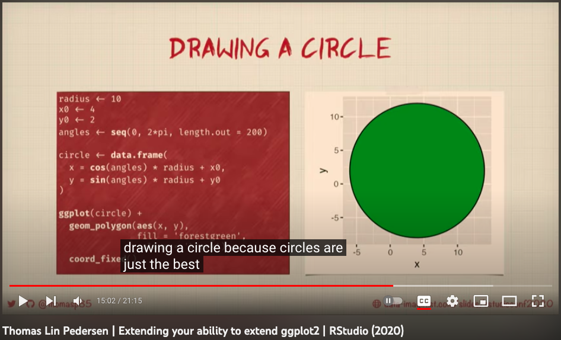
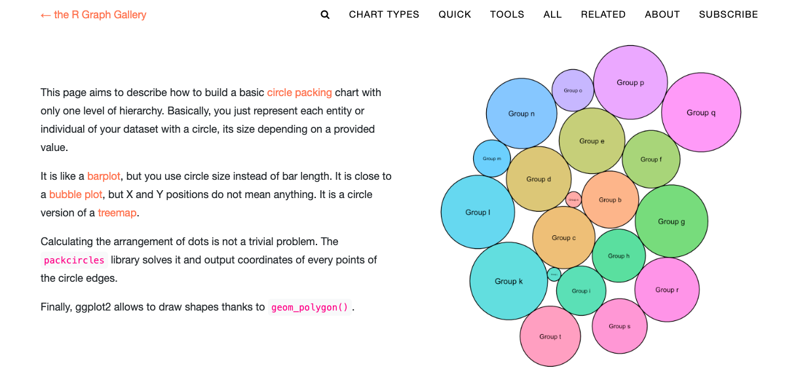
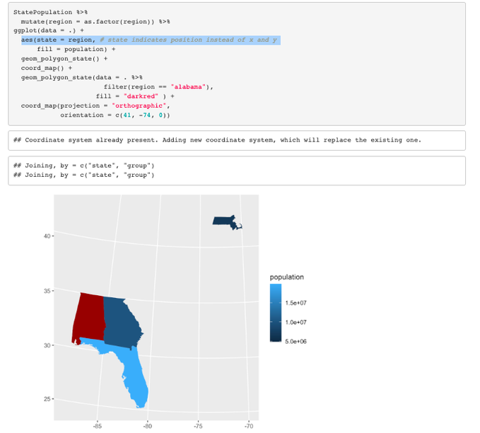

```{r, include = FALSE}
knitr::opts_chunk$set(
  collapse = TRUE,
  comment = "#>",
  # fig.path = "man/figures/README-",
  out.width = "100%",
  cache = TRUE
)
```

class: center


<!-- badges: start -->
<!-- badges: end -->


```{r cars, echo = F, cache=T, message=FALSE, warning=FALSE, fig.align='center', out.width="40%"}
library(tidyverse)
library(ggstamp)  
set.seed(1243)
library(ggcirclepack)

set.seed(12345)
runif(100) %>% c(.,runif(300, max = .2)) %>% 
  tibble(area = .) %>% 
  mutate(id = row_number()) %>% 
  mutate(color = sample(id)) %>% 
  ggplot() + 
  aes(id = id, area = 1/area) + 
  geom_polygon_circlepack(alpha = .70) + 
  coord_equal() + 
  aes(fill = color) +
  stamp_text( y = -.2, size = 12,
             label = "ggcirclepack",
             color = "black") + 
  # coord_equal(xlim = c(-3,3), ylim = c(-2.3, 2.3)) + 
  stamp_text(angle = 30, label = "github.com/...",
             x = 20, y = -30, size = 1.8,
             color = "green") + 
    stamp_polygon(radius = 50, 
                alpha = 0, size = 7,
                color = alpha("black", .9)) +
    stamp_polygon_inverse(radius = 50, radius_outer = Inf, 
                        fill = "white", color = "red"
                        ) +
  theme_void_fill(fill = "cadetblue") +
  theme(legend.position = "none")

```

## {ggcirclepack} and beyond: 

##experiments in the compute_panel space


```{r magick, echo = F, eval = F}
ggsave("hex_sticker_ma_206.png", dpi = 320) 

magick::image_read("hex_sticker_ma_206.png") %>% 
  magick::image_fill("transparent",  "+40+40", fuzz = 40) %>% 
  magick::image_write("hex_sticker_ggcirclepack.png")
```


---

### Critical moment in my extension journey started with TLP "extend your ability to extend".  

```{r, out.width="70%", echo = F}

```

---

## Critical moment in my extension journey started with TLP "extend your ability to extend".  


## Message 1: YOU can be an extender 

--

## Message 2: "where" aesthetics need not only be x and y, in geom_circle() example

--

### - aes(x0 = ?, y0 = ?)

--

### - but ggplot2 actually renders x and y, it computes them for you!

---


# Today I'll present on ggcirclepack. 

--

## Background: ggplot2 grammar guide walk through (reference from data to viz gallery)

https://evamaerey.github.io/ggplot2_grammar_guide/geoms_single_series.html#77

```{r, echo =F, out.width="70%"}

```

---

`r flipbookr::chunk_reveal("background")`

```{r background, include=F}
gapminder::gapminder %>%  
  filter(continent == "Americas") %>%  
  filter(year == 2002) %>%  
  select(country, pop) ->  
prep  

library(packcircles)
# center and radius
circleProgressiveLayout(
  prep$pop,  
  sizetype = 'area'
  ) ->  
pack  

# trace outlines
pack %>%  
  circleLayoutVertices(npoints = 50) ->  
circle_outlines

circle_outlines %>%  
  ggplot() +  
  aes(x = x, y = y) +  
  geom_polygon() +  
  aes(group = id) +  
  aes(fill = factor(id)) +  
  geom_text(data = 
              cbind(prep, pack),  
            aes(x, y, size = pop, 
                label = country,  
                group = NULL, 
                fill = NULL)) +  
  theme(legend.position = "none") +  
  coord_equal()
```


---

## This didn't feel like powerful ggplot2 experience

--

## packcircles 
--
+ ggplot2

--

## What would integrated, ggcirclepack look like? 

---

### in a ggpackcircles::geom_polygon_circlepack(), 

--

### the answer 'where?/which?' of the circle isn't defined by a given center, x0y0, 

--

## but by its *ids* and *areas*, i.e. ase(id = my_entities, area = their_characteristic)

---


## based on these inputs and an algorithm ggplot2 can compute it's 'where?', the x and y to render.


--

### Working with compute_panel(), in other project ggols

---


## Installation

You can install the development version of ggcirclepack from [GitHub](https://github.com/) with:

``` r
# install.packages("devtools")
devtools::install_github("EvaMaeRey/ggcirclepack")
```

---

`r flipbookr::chunk_reveal("example")`

```{r example, include = F}
library(ggcirclepack)
library(tidyverse)
library(magrittr)
library(dplyr)

gapminder::gapminder %>%
filter(year == 2002) %>%
  ggplot() +
  labs(title = "142 gapminder countries in 2002") +
  aes(id = country) + # req aes
  # default area is 1
  geom_polygon_circlepack(alpha = .5) + 
  coord_equal() +
  aes(fill = continent) + 
  aes(area = pop) + 
  geom_text_circlepack() +
  scale_size_continuous(range = c(0, 4)) + 
  facet_wrap(facets = vars(continent)) +
  theme(legend.position = "none") + 
  aes(area = gdpPercap*pop) + 
  aes(area = gdpPercap)
```


---
### Implementation: compute_panel_circle_pack

```{r}
readLines("../R/geom_circle_pack.R")[30:51]
```


---
### Implementation: ggproto

```{r}
readLines("../R/geom_circle_pack.R")[55:62]
```

---
### Implementation: geom_polygon_circlepack

```{r}
readLines("../R/geom_circle_pack.R")[97:110]
```


---

## Top wish list item for ggcirclepack:

### More computation under the hood for a count data case.  

```{r}
tidytitanic::tidy_titanic %>% 
  head()
```


---

`r flipbookr::chunk_reveal("titanic", display = "code")`

```{r titanic, eval = F, echo = F}
tidytitanic::tidy_titanic() + 
  ggplot() + 
  aes(x = "all") + 
  geom_polygon_circlepack_count(alpha = .5) + 
  geom_text_circlepack_count() + # automatically labels with count
  aes(linetype = sex) + 
  aes(color = age) + 
  aes(alpha = survived) + 
  facet_wrap(~class)
```

---

## Other wish list item


--

### Include other circlepacking algorithms?

--

### get feedback from {packcircles} author! 

--

### Compare with {ggforce} circle packing, others?

---

## 'Circles are just the best'  TLP


--

## If you squint, a Texas and a Circle look like pretty much the same thing.

--

## In ggplot2's eyes, just polygons.


---

### Also experimental: maps and atlasses.

--

aes(where = ?)  -> xy

--

aes(x0y0 = ?) -> xy

--

aes(us_state = ?)

--

aes(fips = ?) # us county codes

--

aes(brain_segment = ?)

--

aes(anatomy_tissue = ?)


---

# U.S. States 

- inheriting from geom_polygon
- 'computing' state xy perimeter based aes = my_state_var
- Ryan Miller tutorial start point.


https://evamaerey.github.io/mytidytuesday/2022-11-04-brain/brain.html

---

```{r, out.width="50%"}

```

'Oh wow cool! That looks like a convenient map layer'

---

### WO extension make a map with geom_polygon tutorial:  https://remiller1450.github.io/s230s19/Intro_maps.html

--

`r flipbookr::chunk_reveal("maps_original", break_type = 2)`

```{r maps_original, include = F}
library(maps)
MainStates <- map_data("state")
StatePopulation <- read.csv("https://raw.githubusercontent.com/ds4stats/r-tutorials/master/intro-maps/data/StatePopulation.csv", as.is = TRUE)

MergedStates <- inner_join(MainStates, 
                           StatePopulation, 
                           by = "region")

StatePopulation %>% 
  right_join(MainStates) %>% 
  ggplot() + 
  geom_polygon() + 
  aes(x = long, 
      y = lat, 
      group = group, 
      fill = population/1000000) + 
  coord_map(projection = "orthographic", 
            orientation = c(41, -74, 0))
```

---

## create geom_polygon_state() extension

### compute_state ('algorithm' is to join reference data)

```{r}
StatePopulation <- read.csv("https://raw.githubusercontent.com/ds4stats/r-tutorials/master/intro-maps/data/StatePopulation.csv", as.is = TRUE)

MainStates %>% 
  rename(state = region) %>% 
  rename(which_polygon = group) ->
continuous_states

compute_state <- function(data, scales){
 
  data %>% 
    inner_join(continuous_states, multiple = "all") %>% 
    mutate(x = long, y = lat) %>% 
    arrange(order) %>%
    # mutate(group = paste(group, ".", which_polygon)) %>%
    # group_by(which_polygon) %>%
    data.frame()

}
```


---

## create geom_polygon_state() extension

### ggproto StatPolygonstate

```{r}
StatPolygonstate <- ggplot2::ggproto(`_class` = "StatPolygonstate",
                                  `_inherit` = ggplot2::Stat,
                                  required_aes = c("state"),
                                  # setup_data = my_setup_data,
                                  compute_panel = compute_state,
                                  default_aes = aes(group = after_stat(which_polygon))
                                  )


```

---

## create geom_polygon_state() extension

### the geom itself

```{r}
geom_polygon_state <- function(
  mapping = NULL,
  data = NULL,
  position = "identity",
  na.rm = FALSE,
  show.legend = NA,
  inherit.aes = TRUE, ...) {
  ggplot2::layer(
    stat = StatPolygonstate,  # proto object from step 2
    geom = ggplot2::GeomPolygon,  # inherit other behavior
    data = data,
    mapping = mapping,
    position = position,
    show.legend = show.legend,
    inherit.aes = inherit.aes,
    params = list(na.rm = na.rm, ...)
  )
}


```

---

`r flipbookr::chunk_reveal("geom_polygon_state")`

```{r geom_polygon_state, include = F}
StatePopulation %>% 
  mutate(region = region %>% stringr::str_trim() %>% as.factor()) %>% 
  ggplot(data = .) + 
  aes(state = region) + # state indicates position instead of x and y 
  geom_polygon_state() + 
  aes(fill = population) +
  coord_map(projection = "orthographic", 
            orientation = c(41, -74, 0)) + 
  geom_polygon_state(data = . %>% 
                       filter(region == "new york"),
                     color = "red" ) + 
  geom_polygon_state(data = . %>% 
                       filter(region == "colorado"),
                     color = "green" ) + 
  scale_fill_viridis_c(option = "magma", end = .9) + 
  ggstamp::stamp_point(y = 30.2, x = -97.7, 
                       color = "goldenrod1",
                       size = 2)
```


---

# U.S. counties, geom_polygon_fips?


```{r fips, echo = F, message = F,warning=F}
library(tidyverse)
library(sf)

# Claus on github
fips_geometries <- readRDS(url("https://wilkelab.org/SDS375/datasets/US_counties.rds")) %>%
  rename(FIPS = GEOID)

US_census <- read_csv("https://wilkelab.org/SDS375/datasets/US_census.csv",
                      col_types = cols(FIPS = "c")
          )

# works
fips_geometries %>%
  left_join(US_census, by = "FIPS") %>%
  ggplot() +
  geom_sf(aes(fill = home_ownership)) + 
  scale_fill_viridis_c()
```

---

`r flipbookr::chunk_reveal("fips")`

---


---


- inheriting from geom_sf()
- 'computing' fips sf geometries column (xy perimeters) based on aes(fips = my_fips_code)
- Wilke example start point

https://evamaerey.github.io/mytidytuesday/2023-03-10-ggfips/ggfips_w_sf.html


---

# Brain seg

- inheriting from geom_sf() 
- 'computing' tissue space based on aes = my_seg_name variable
- atlases from ggseg


https://evamaerey.github.io/mytidytuesday/2023-03-12-ggbrain-seg-sf/ggbrain_seg_sf.html


---

```{r, }
library(gganatogram)

a <- gganatogram(data=hgFemale_key, outline = T, fillOutline='#a6bddb', organism='human', sex='female', fill="colour") 

a + 
  ggstamp::stamp_wash() +
  geom_path(data = hgFemale_list$brain, aes(x = x, y = -y), color = "red", size = .5, linetype = "dashed") +
  coord_equal()


hgFemale_list$liver %>% 
  rename(organ = id) %>% 
  left_join(hgFemale_key) ->
liver_with_other_info
```


